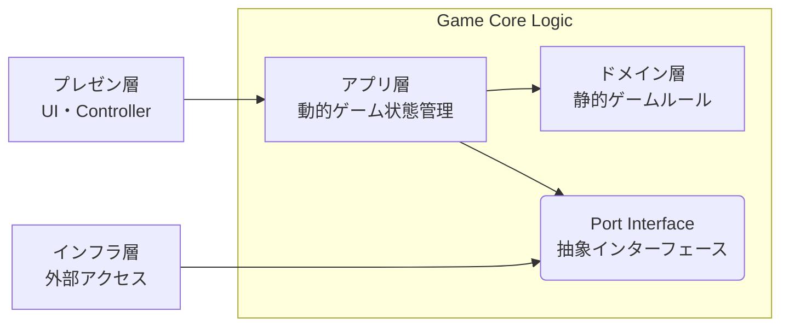

# アーキテクチャ概要

## コンセプト: 4 層構造 かつドメイン中心の Clean Architecture

ゲームロジックを UI・外部リソースから完全に分離し、変更に強くテストしやすい構成にする。

1. **Domain Layer（ドメイン層）** : 外部に依存しない静的ゲームルール
2. **Application Layer（アプリ層）** : ユースケース・動的ゲーム状態管理
3. **Infrastructure Layer（インフラ層）** : DB アクセス・外部 API アクセス
4. **Presentation Layer（プレゼン層）** : UI・Controller



**ディレクトリ構造**

```
skeleton-app/src/lib/
├── domain/          # ドメイン層
├── application/     # アプリ層
├── infrastructure/  # インフラ層
└── presentation/    # プレゼン層
```

---

## レイヤー構成

### Domain Layer

**責任**:

- 「遊戯王のルール」そのものを表現する
- 外部に依存しない静的ゲームルール

**ディレクトリ構造**

```
skeleton-app/src/lib/domain/
├── models/      # データモデル
├── rules/       # 基本ルール
├── registries/  # 各種レジストリ（Registry Pattern）
├── effects/     # 効果処理
│   ├── actions/ # チェーンブロックを作る処理の具象実装
│   └── rules/   # 追加適用するルールの具象実装
└── commands/    # ゲーム操作の具象実装（Command Pattern）
```

**重要**:

- 何にも依存しない（Pure TypeScript）
- ここには Svelte や DOM のコードを一切書かない
- ロジック単体でのテストが可能

**主要コンポーネント**:

- **GameState**: イミュータブルなゲーム状態モデル
  - すべてのゾーン（デッキ、手札、フィールド、墓地）を保持
  - ターン数、現在のフェーズ、ゲーム結果を管理
  - `readonly` 修飾子で不変性を保証
  - オブジェクトの一部を書き換えるのではなく、変更があった部分をコピーして新しいオブジェクトを作る

- **CardDataRegistry**: カードデータのレジストリ（Registry Pattern）
  - カードの静的データ（type, frameType 等）を管理
  - Card ID → CardData のマッピング
  - 関数ベースの実装（getCardData, hasCardData 等）
  - O(1) 高速ルックアップ

- **ChainableActionRegistry**: チェーンブロックを作る処理のレジストリ（Registry Pattern + Strategy Pattern）
  - 「カードの発動」と「効果の発動」の処理を管理
  - Card ID → ChainableAction のマッピング
  - クラスベースの実装（register, get, clear 等）
  - 各カード固有の効果処理を交換可能に（Strategy Pattern）
  - CONDITIONS（発動条件）、ACTIVATION（発動時の処理）、RESOLUTION（効果の解決）の 3 ステップ構成

- **AdditionalRuleRegistry**: 追加適用するルールのレジストリ（Registry Pattern）
  - 永続効果、ルール効果、効果外テキストを管理
  - Card ID → AdditionalRule[] のマッピング（1 枚のカードに複数のルールが存在可能）
  - カテゴリ別フィルタ機能（getByCategory）
  - フィールド全体から適用可能なルールを収集（collectActiveRules）
  - データ書き換え（apply）、判定追加（checkPermission）、処理置換（replace）の 3 つの介入方式

- **GameCommand**: ゲーム操作の具象実装（Command Pattern）
  - 統一された`canExecute()` / `execute()`インターフェース
  - 具象実装: DrawCardCommand, ActivateSpellCommand, AdvancePhaseCommand 等
  - spread 構文によるゲーム状態の不変更新を保証
  - 行動履歴の追跡とテストが容易
  - `GameStateUpdateResult`を返却（newState + オプショナルな effectSteps）
  - 効果処理ステップはアプリ層に委譲（Clean Architecture 準拠）

### Application Layer

**責任**:

- ユーザーの操作を、Command として Domain に伝える（ユースケース）
- Domain の処理結果を Store に反映（動的ゲーム状態管理）
- Domain と Presentation の間のデータ変換

**ディレクトリ構造**

```
skeleton-app/src/lib/application/
├── ports/         # Port Interface（インフラ層への依存抽象化）
├── types/         # DTO（CardDisplayData, DeckRecipe等）
├── data/          # サンプルデッキレシピ等の静的データ
├── utils/         # デッキローダー等のユーティリティ
├── stores/        # Svelte Storeによる状態管理
└── GameFacade.ts  # プレゼン層とドメイン層の橋渡し（Facade Pattern）
```

**主要コンポーネント**:

- **GameFacade**: UI からの単一窓口（Facade Pattern）
  - プレゼン層 と ドメイン層 の橋渡し
  - ドメイン層の Commands を呼び出し、結果を Store に反映
  - すべてのゲーム操作コマンドのエンドポイントをシンプルなメソッドで提供
  - Store 更新の責任を一元管理

- **Stores**: 状態管理（Observer Pattern）
  - Svelte Store（`writable`, `derived`）による実装
  - 状態の変化を UI に通知
  - Derived Stores で計算コストの高い派生値をキャッシュ
  - 不変オブジェクト（spread 構文）による更新検知で Svelte の再描画を最適化

- **Ports**: 抽象インターフェース（Port/Adapter Pattern）
  - インフラ層への依存を抽象化
  - 例: `ICardDataRepository`（カードデータ取得の抽象）

- **Types & DTOs**: アプリ層のデータ型
  - `CardDisplayData`: UI 表示用のカード情報
  - `DeckRecipe`: デッキレシピ定義
  - ドメイン層の型（`CardData`）とは明確に区別

### Infrastructure Layer

**責任**:

- 外部 API との統合（YGOPRODeck API v7 等）
- Port/Adapter パターンによる抽象化
- アプリ層 から外部リソースへの依存を隔離

**ディレクトリ構造**

```
skeleton-app/src/lib/infrastructure/
├── adapters/  # Port/Adapter実装（YGOProDeckCardDataRepository等）
├── api/       # 外部API統合（YGOPRODeck API v7、死活監視）
├── types/     # 外部API型定義（YGOProDeckCard等）
└── utils/     # HTTP通信ヘルパー（fetch wrapper）
```

**主要コンポーネント**:

- **Adapters**: Port/Adapter Pattern 実装
  - アプリ層 定義の Port を実装
  - 例: `YGOProDeckCardDataRepository`（ICardDataRepository 実装）

- **API Clients**: 外部 API 統合
  - YGOPRODeck API v7 統合（バッチリクエスト、メモリキャッシュ）
  - API 死活監視

- **Types**: 外部 API 型定義
  - YGOProDeckCard 型（外部 API レスポンス構造）

- **Utils**: HTTP 通信ヘルパー
  - 統一された fetch wrapper

**依存性逆転（Port/Adapter Pattern）**:

- アプリ層 は抽象 Port（`ICardDataRepository`）に依存
- インフラ層 が具象 Adapter（`YGOProDeckCardDataRepository`）を提供
- → アプリ層 は API 実装詳細から完全に分離

**キャッシング戦略**:

- セッション単位メモリキャッシュ（ページリロードまで）
- 重複 API リクエスト防止、レスポンス時間短縮

### Presentation Layer

**責任**:

- Store の状態を画面に描画
- ユーザー入力を受け取る
- UI 状態管理（モーダル表示、カード選択等）
- UI 専用のユーティリティ機能（ナビゲーション、アニメーション、音声再生等）

**ディレクトリ構造**

```
skeleton-app/src/lib/presentation/
├── components/  # UIコンポーネント（Atomic Design）
│   ├── atoms/      # 基本UI部品（Button, Card等）
│   ├── molecules/  # 組み合わせUI（CardList等）
│   ├── organisms/  # 複合UI（DuelField, Hands等）
│   └── modals/     # モーダルダイアログ
├── stores/      # UI状態管理（カード選択、モーダル表示、テーマ、音声）
├── types/       # アプリ層からの型再エクスポート（後方互換性）
├── utils/       # UI専用ユーティリティ（ナビゲーション、音声再生等）
├── assets/      # 画像ファイル
└── constants/   # UI定数値
```

**主要コンポーネント**:

- **Components**: Atomic Design 構成（atoms/molecules/organisms/modals）
- **Stores**: UI 状態管理（カード選択、モーダル表示、テーマ、音声）
- **Types**: アプリ層 からの型再エクスポート（後方互換性）
- **Utils**: UI 専用ユーティリティ（ナビゲーション、トランジション、音声再生）
- **Assets & Constants**: 画像ファイル、UI 定数値

**ロジックの責務**:

- ✅ 表示ロジック（アニメーション、モーダル制御等）
- ❌ ゲームロジック（攻撃力計算等）→ Application/ドメイン層 に委譲

---

## データフロー (Unidirectional)

```
1. User Action
   ユーザーがカードをクリック

2. Dispatch
   UI が GameFacade.activateSpell(cardId) を呼ぶ

3. Validate & Execute
   ドメイン層がルール判定し、状態を更新
   新しい GameState を返す

4. State Update
   Store が新しい GameState で上書き

5. Re-render
   Svelte が変更を検知し、画面を再描画
```

---

## 関連ドキュメント

- [ドメイン知識](../domain/overview.md) - 遊戯王ルール
- [Card モデル設計](./card-model-design.md) - ドメイン内の静的データモデルと外部 API 由来のデータ統合
- [Effect モデル設計](./effect-model-design.md) - 効果処理の配置設計
- [テスト戦略](./testing-strategy.md) - テストの方針と実装方法
- [設計判断記録](../adr/) - アーキテクチャ上の重要な決定を記録
