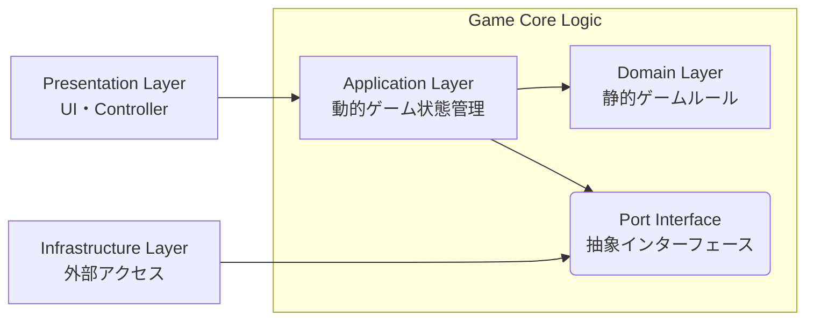

# アーキテクチャ概要

## コンセプト: 4層構造 かつドメイン中心の Clean Architecture 

ゲームロジックをUI・外部リソースから完全に分離し、変更に強くテストしやすい構成にする。

1. **Domain Layer** : 外部に依存しない静的ゲームルール
2. **Application Layer** : ユースケース・動的ゲーム状態管理
3. **Infrastructure Layer** : DBアクセス・外部APIアクセス
4. **Presentation Layer** : UI・Controller



---

## レイヤー構成

### Domain Layer (核心)

**場所**: `skeleton-app/src/lib/domain/`

**責任**:
- 「遊戯王のルール」そのものを表現する
- 不変性を保証した純粋なゲームロジック

**依存**:
- 何にも依存しない（Pure TypeScript）
- SvelteやDOMのコードは一切含まない

**主要コンポーネント**:

```typescript
// GameState: 不変なゲーム状態
interface GameState {
  readonly zones: {
    readonly deck: readonly CardInstance[];
    readonly hand: readonly CardInstance[];
    readonly field: readonly CardInstance[];
    readonly graveyard: readonly CardInstance[];
  };
  readonly turnNumber: number;
  readonly currentPhase: Phase;
  readonly gameResult: GameResult | null;
}

// Rules: ゲームルールの判定
class VictoryRule {
  check(state: GameState): GameResult | null
}

class PhaseRule {
  canAdvance(state: GameState): boolean
  getNextPhase(current: Phase): Phase
}
```

**重要**:
- ここには Svelte や DOM のコードを一切書かない
- ロジック単体でのテストが可能

### Application Layer (接着剤)

**場所**: `skeleton-app/src/lib/application/`

**責任**:
- ユーザーの操作（「カードをクリックした」）をドメインの言葉（「発動アクション」）に変換
- エンジンの処理結果をStoreに反映
- Domain/Presentation Layer間のデータ変換

**主要コンポーネント**:

```typescript
// Commands: すべての操作をコマンド化（Command Pattern）
abstract class GameCommand {
  abstract execute(state: GameState): GameState;
}

// 各CommandはImmer.jsで不変更新を実現
// 例: DrawCardCommand, ActivateSpellCommand, AdvancePhaseCommand

// GameFacade: UIからの単一窓口（Facade Pattern）
class GameFacade {
  drawCard(): void
  activateSpell(cardId: string): void
  advancePhase(): void
}
```

**ディレクトリ構成**:
- `commands/`: Command Pattern実装（ドロー、発動、フェーズ遷移等）
- `effects/`: CardEffectRegistry（Strategy Patternによる効果管理）
- `ports/`: Port Interface（Infrastructure層への依存抽象化）
- `types/`: DTO（CardDisplayData, DeckRecipe等）
- `stores/`: Svelte Storeによる状態管理
- `utils/`: デッキローダー等のユーティリティ
- `data/`: サンプルデッキレシピ等の静的データ

### Infrastructure Layer (外部アクセス)

**場所**: `skeleton-app/src/lib/infrastructure/`

**責任**:
- 外部APIとの統合（YGOPRODeck API v7等）
- Port/Adapterパターンによる抽象化
- Application Layerから外部リソースへの依存を隔離

**主要コンポーネント**:

- **Adapters**: Port/Adapter Pattern実装
  - Application Layer定義のPortを実装
  - 例: `YGOProDeckCardRepository`（ICardDataRepository実装）

- **API Clients**: 外部API統合
  - YGOPRODeck API v7統合（バッチリクエスト、メモリキャッシュ）
  - API死活監視

- **Types**: 外部API型定義
  - YGOProDeckCard型（外部APIレスポンス構造）

- **Utils**: HTTP通信ヘルパー
  - 統一されたfetch wrapper

**依存性逆転（Port/Adapter Pattern）**:
- Application Layerは抽象Port（`ICardDataRepository`）に依存
- Infrastructure Layerが具象Adapter（`YGOProDeckCardRepository`）を提供
- → Application LayerはAPI実装詳細から完全に分離

**キャッシング戦略**:
- セッション単位メモリキャッシュ（ページリロードまで）
- 重複APIリクエスト防止、レスポンス時間短縮

### Presentation Layer (見た目)

**場所**: `skeleton-app/src/lib/presentation/`

**責任**:
- Storeの状態を画面に描画
- ユーザー入力を受け取る
- UI状態管理（モーダル表示、カード選択等）
- UI専用のユーティリティ機能（ナビゲーション、アニメーション、音声再生等）

**技術スタック**:
- Svelte 5 (Runes: `$state`, `$derived`, `$effect`)
- Skeleton UI v3
- TailwindCSS v4

**主要コンポーネント**:

- **Components**: Atomic Design構成（atoms/molecules/organisms/modals）
- **Stores**: UI状態管理（カード選択、モーダル表示、テーマ、音声）
- **Types**: Application Layerからの型再エクスポート（後方互換性）
- **Utils**: UI専用ユーティリティ（ナビゲーション、トランジション、音声再生）
- **Assets & Constants**: 画像ファイル、UI定数値

**ロジックの責務**:
- ✅ 表示ロジック（アニメーション、モーダル制御等）
- ❌ ゲームロジック（攻撃力計算等）→ Application/Domain Layerに委譲

## データフロー (Unidirectional)

```
1. User Action
   ユーザーがカードをクリック

2. Dispatch
   UI が GameFacade.activateSpell(cardId) を呼ぶ

3. Validate & Execute
   ドメイン層がルール判定し、状態を更新
   新しい GameState を返す

4. State Update
   Store が新しい GameState で上書き

5. Re-render
   Svelte が変更を検知し、画面を再描画
```

## 設計原則

### 1. 不変性 (Immutability)

**実装**: Immer.js + TypeScript `readonly` 修飾子

```typescript
// ❌ Bad: 直接書き換え
state.zones.hand.push(card);

// ✅ Good: Immerで不変更新
return produce(state, draft => {
  draft.zones.hand.push(card);
});
```

**メリット**:
- 変更履歴の追跡が容易
- Svelte Storeとの相性が良い
- バグの原因となる意図しない状態変更を防ぐ

### 2. Command Pattern

すべての操作をCommandクラスで実装：

**メリット**:
- 行動履歴（ログ）の保存が容易
- 将来的に「Undo」機能を実装する際に対応しやすい
- テストが書きやすい

### 3. Strategy Pattern

カードごとの異なる効果処理を交換可能にする：

```typescript
interface CardEffect {
  canActivate(state: GameState): boolean;
  execute(state: GameState): Promise<EffectResult>;
}
```

**実装**: Effect System (Strategy Pattern + Registry Pattern) により、カード効果を実装しています（ADR-0005参照）。ADR-0003でCommand統一を決定しましたが、カード効果の複雑性に対応するため、ADR-0005でEffect Systemを再導入しました。

**詳細な実装例**: カード効果の具体的な実装方法、データモデル設計については [data-model-design.md](./data-model-design.md) を参照してください。

### 4. Observer Pattern

状態の変化をUIに通知：

**実装**: Svelte Store (`writable`, `derived`)

```typescript
// Store定義
export const gameStateStore = writable<GameState>(initialState);

// UI購読
<script>
  const gameState = $gameStateStore; // Svelte 5 Runes
</script>
```

## ファイル構造

```
skeleton-app/src/lib/
├── domain/                    # Domain Layer
│   ├── models/
│   │   ├── GameState.ts       # ゲーム状態定義
│   │   ├── Card.ts            # カード型定義・DomainCardData
│   │   ├── Phase.ts           # フェーズ型定義
│   │   └── constants.ts       # ドメイン定数
│   ├── rules/
│   │   ├── VictoryRule.ts     # 勝利条件判定
│   │   ├── PhaseRule.ts       # フェーズ遷移ルール
│   │   └── SpellActivationRule.ts
│   ├── effects/               # カード効果（Strategy Pattern）
│   │   ├── CardEffect.ts      # Effect Interface
│   │   ├── EffectResolutionStep.ts
│   │   ├── bases/
│   │   │   ├── SpellEffect.ts
│   │   │   └── NormalSpellEffect.ts
│   │   └── implementations/
│   │       ├── PotOfGreedEffect.ts
│   │       └── GracefulCharityEffect.ts
│   ├── commands/
│   │   └── GameCommand.ts     # Command基底クラス
│   └── data/
│       └── exodiaPartNames.ts # ドメインデータ
│
├── application/               # Application Layer
│   ├── commands/
│   │   ├── DrawCardCommand.ts
│   │   ├── ActivateSpellCommand.ts
│   │   ├── AdvancePhaseCommand.ts
│   │   └── DiscardCardsCommand.ts
│   ├── effects/
│   │   └── CardEffectRegistry.ts  # カードID→Effectマッピング
│   ├── ports/                 # Port Interfaces
│   │   └── ICardDataRepository.ts
│   ├── types/                 # Application Layer型定義
│   │   ├── card.ts            # CardDisplayData (DTO)
│   │   └── deck.ts            # DeckRecipe等 (DTO)
│   ├── data/
│   │   └── sampleDeckRecipes.ts
│   ├── utils/
│   │   └── deckLoader.ts      # デッキロード処理
│   ├── stores/
│   │   ├── gameStateStore.ts
│   │   ├── effectResolutionStore.ts
│   │   └── cardDisplayStore.ts
│   └── GameFacade.ts          # UIからの窓口
│
├── infrastructure/            # Infrastructure Layer
│   ├── adapters/
│   │   └── YGOProDeckCardRepository.ts  # ICardDataRepository実装
│   ├── api/
│   │   ├── ygoprodeck.ts      # YGOPRODeck API v7統合
│   │   ├── checkHeartbeat.ts
│   │   └── paths.ts
│   ├── types/
│   │   └── ygoprodeck.ts      # YGOProDeckCard型
│   └── utils/
│       └── request.ts         # HTTP通信ヘルパー
│
└── presentation/              # Presentation Layer
    ├── components/
    │   ├── atoms/
    │   ├── molecules/
    │   ├── organisms/
    │   │   └── board/
    │   │       ├── DuelField.svelte
    │   │       ├── Hands.svelte
    │   │       └── Field.svelte
    │   └── modals/
    │       ├── CardDetailModal.svelte
    │       └── CardSelectionModal.svelte
    ├── stores/
    │   ├── cardSelectionStore.svelte.ts
    │   ├── cardDetailDisplayStore.ts
    │   ├── theme.ts
    │   └── audio.ts
    ├── types/                 # Presentation型（再エクスポート）
    │   ├── card.ts
    │   ├── deck.ts
    │   ├── effect.ts
    │   └── phase.ts
    ├── utils/
    │   ├── navigation.ts
    │   ├── transitions.ts
    │   ├── beep.ts
    │   └── toaster.ts
    ├── assets/
    │   └── images/
    └── constants/
        └── ui.ts
```

## 技術スタック

### フロントエンド
- **フレームワーク**: SvelteKit + Svelte 5
- **UIライブラリ**: Skeleton UI v3
- **CSS**: TailwindCSS v4
- **状態管理**: Svelte Stores + Immer.js
- **型チェック**: TypeScript (Strict mode)
- **テスト**: Vitest + Playwright

### バックエンド（開発時のみ）
- **フレームワーク**: FastAPI + Python
- **用途**: カードデータAPI提供
- **本番**: 静的ビルド（GitHub Pages）でバックエンド不要

## パフォーマンス最適化

### 不変オブジェクトによる更新検知

- GameState の更新は、オブジェクトの一部を書き換えるのではなく、変更があった部分をコピーして新しいオブジェクトを作る
- Svelte は参照の変更を検知して再描画するため、無駄なレンダリングを防ぐ

### Derived Stores

計算コストの高い派生値はキャッシュ：

```typescript
export const handCardCount = derived(
  gameStateStore,
  $state => $state.zones.hand.length
);
```

## 関連ドキュメント

- [設計判断記録](../adr/) - アーキテクチャ上の重要な決定を記録
- [テスト戦略](./testing-strategy.md) - テストの方針と実装方法
- [遊戯王ルール](../domain/yugioh-rules.md) - ドメイン知識
