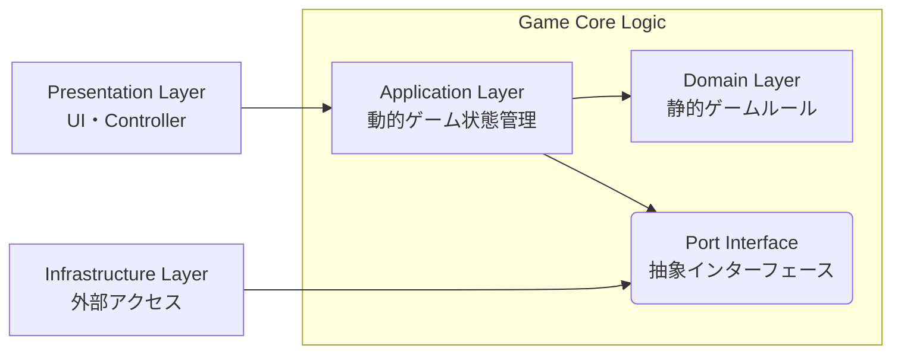

# アーキテクチャ概要

## コンセプト: 4 層構造 かつドメイン中心の Clean Architecture

ゲームロジックを UI・外部リソースから完全に分離し、変更に強くテストしやすい構成にする。

1. **Domain Layer** : 外部に依存しない静的ゲームルール
2. **Application Layer** : ユースケース・動的ゲーム状態管理
3. **Infrastructure Layer** : DB アクセス・外部 API アクセス
4. **Presentation Layer** : UI・Controller



**ディレクトリ構造**

```
skeleton-app/src/lib/
├── domain/          # Domain Layer
├── application/     # Application Layer
├── infrastructure/  # Infrastructure Layer
└── presentation/    # Presentation Layer
```

---

## レイヤー構成

### Domain Layer

**責任**:

- 「遊戯王のルール」そのものを表現する
- 外部に依存しない静的ゲームルール

**ディレクトリ構造**

```
skeleton-app/src/lib/domain/
├── models/    # データモデル（GameState, CardData, Zone等）
├── rules/     # ゲームルール定義（VictoryRule, PhaseRule等）
├── effects/   # カード効果（Strategy Pattern実装）+ CardEffectRegistry
├── commands/  # Command Pattern実装（DrawCard, ActivateSpell等）
└── data/      # ゲームルールに不可欠なカードデータ
```

**重要**:

- 何にも依存しない（Pure TypeScript）
- ここには Svelte や DOM のコードを一切書かない
- ロジック単体でのテストが可能

**主要コンポーネント**:

- **GameState**: 不変なゲーム状態

  - すべてのゾーン（デッキ、手札、フィールド、墓地）を保持
  - ターン数、現在のフェーズ、ゲーム結果を管理
  - `readonly` 修飾子で不変性を保証
  - オブジェクトの一部を書き換えるのではなく、変更があった部分をコピーして新しいオブジェクトを作る

- **Rules**: ゲームルールの判定

  - VictoryRule: 勝利条件の判定（エクゾディア、ライフポイント等）
  - PhaseRule: フェーズ遷移の可否判定と次フェーズの決定
  - SpellActivationRule: 魔法・罠カードの発動可否判定

- **CardEffect**: カード効果の基底クラス（Strategy Pattern）

  - 統一された`canActivate()` / `createSteps()`インターフェース
  - カード種別ごとの階層構造（CardEffect → SpellEffect → NormalSpellEffect → PotOfGreedEffect）
  - カードごとに異なる効果処理を交換可能に
  - CardEffectRegistry: カードID→CardEffectインスタンスのマッピング管理（Registry Pattern）

- **GameCommand**: ゲーム操作の具象実装（Command Pattern）

  - 統一された`canExecute()` / `execute()`インターフェース
  - 具象実装: DrawCardCommand, ActivateSpellCommand, AdvancePhaseCommand等
  - spread構文によるゲーム状態の不変更新を保証
  - 行動履歴の追跡とテストが容易

### Application Layer

**責任**:

- ユーザーの操作を、Command として Domain に伝える（ユースケース）
- Domain の処理結果を Store に反映（動的ゲーム状態管理）
- Domain と Presentation の間のデータ変換

**ディレクトリ構造**

```
skeleton-app/src/lib/application/
├── ports/         # Port Interface（Infrastructure層への依存抽象化）
├── types/         # DTO（CardDisplayData, DeckRecipe等）
├── data/          # サンプルデッキレシピ等の静的データ
├── utils/         # デッキローダー等のユーティリティ
├── stores/        # Svelte Storeによる状態管理
└── GameFacade.ts  # Presentation LayerとDomain Layerの橋渡し（Facade Pattern）
```

**主要コンポーネント**:

- **GameFacade**: UIからの単一窓口（Facade Pattern）

  - Presentation LayerとDomain Layerの橋渡し
  - Domain層のCommandsを呼び出し、結果をStoreに反映
  - すべてのゲーム操作をシンプルなメソッドで提供
  - Store更新の責任を一元管理

- **Stores**: 状態管理（Observer Pattern）

  - Svelte Store（`writable`, `derived`）による実装
  - 状態の変化をUIに通知
  - Derived Storesで計算コストの高い派生値をキャッシュ
  - 不変オブジェクト（spread構文）による更新検知でSvelteの再描画を最適化

- **Ports**: 抽象インターフェース（Port/Adapter Pattern）

  - Infrastructure層への依存を抽象化
  - 例: `ICardDataRepository`（カードデータ取得の抽象）

- **Types & DTOs**: Application層のデータ型
  - `CardDisplayData`: UI表示用のカード情報
  - `DeckRecipe`: デッキレシピ定義
  - Domain層の型（`CardData`）とは明確に区別

### Infrastructure Layer

**責任**:

- 外部 API との統合（YGOPRODeck API v7 等）
- Port/Adapter パターンによる抽象化
- Application Layer から外部リソースへの依存を隔離

**ディレクトリ構造**

```
skeleton-app/src/lib/infrastructure/
├── adapters/  # Port/Adapter実装（YGOProDeckCardRepository等）
├── api/       # 外部API統合（YGOPRODeck API v7、死活監視）
├── types/     # 外部API型定義（YGOProDeckCard等）
└── utils/     # HTTP通信ヘルパー（fetch wrapper）
```

**主要コンポーネント**:

- **Adapters**: Port/Adapter Pattern 実装

  - Application Layer 定義の Port を実装
  - 例: `YGOProDeckCardRepository`（ICardDataRepository 実装）

- **API Clients**: 外部 API 統合

  - YGOPRODeck API v7 統合（バッチリクエスト、メモリキャッシュ）
  - API 死活監視

- **Types**: 外部 API 型定義

  - YGOProDeckCard 型（外部 API レスポンス構造）

- **Utils**: HTTP 通信ヘルパー
  - 統一された fetch wrapper

**依存性逆転（Port/Adapter Pattern）**:

- Application Layer は抽象 Port（`ICardDataRepository`）に依存
- Infrastructure Layer が具象 Adapter（`YGOProDeckCardRepository`）を提供
- → Application Layer は API 実装詳細から完全に分離

**キャッシング戦略**:

- セッション単位メモリキャッシュ（ページリロードまで）
- 重複 API リクエスト防止、レスポンス時間短縮

### Presentation Layer

**責任**:

- Store の状態を画面に描画
- ユーザー入力を受け取る
- UI 状態管理（モーダル表示、カード選択等）
- UI 専用のユーティリティ機能（ナビゲーション、アニメーション、音声再生等）

**ディレクトリ構造**

```
skeleton-app/src/lib/presentation/
├── components/  # UIコンポーネント（Atomic Design）
│   ├── atoms/      # 基本UI部品（Button, Card等）
│   ├── molecules/  # 組み合わせUI（CardList等）
│   ├── organisms/  # 複合UI（DuelField, Hands等）
│   └── modals/     # モーダルダイアログ
├── stores/      # UI状態管理（カード選択、モーダル表示、テーマ、音声）
├── types/       # Application Layerからの型再エクスポート（後方互換性）
├── utils/       # UI専用ユーティリティ（ナビゲーション、音声再生等）
├── assets/      # 画像ファイル
└── constants/   # UI定数値
```

**主要コンポーネント**:

- **Components**: Atomic Design 構成（atoms/molecules/organisms/modals）
- **Stores**: UI 状態管理（カード選択、モーダル表示、テーマ、音声）
- **Types**: Application Layer からの型再エクスポート（後方互換性）
- **Utils**: UI 専用ユーティリティ（ナビゲーション、トランジション、音声再生）
- **Assets & Constants**: 画像ファイル、UI 定数値

**ロジックの責務**:

- ✅ 表示ロジック（アニメーション、モーダル制御等）
- ❌ ゲームロジック（攻撃力計算等）→ Application/Domain Layer に委譲

---

## データフロー (Unidirectional)

```
1. User Action
   ユーザーがカードをクリック

2. Dispatch
   UI が GameFacade.activateSpell(cardId) を呼ぶ

3. Validate & Execute
   ドメイン層がルール判定し、状態を更新
   新しい GameState を返す

4. State Update
   Store が新しい GameState で上書き

5. Re-render
   Svelte が変更を検知し、画面を再描画
```

---

## 関連ドキュメント

- [遊戯王ルール](../domain/yugioh-rules.md) - ドメイン知識
- [データモデル設計](./data-model-design.md) - ドメイン内の静的データモデルと外部 API 由来のデータ統合
- [テスト戦略](./testing-strategy.md) - テストの方針と実装方法
- [設計判断記録](../adr/) - アーキテクチャ上の重要な決定を記録
