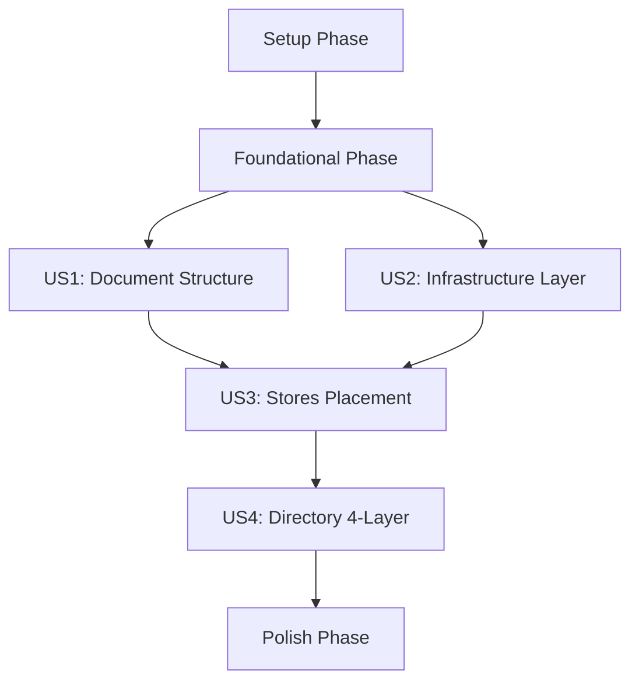

# Implementation Tasks: 4層Clean Architectureへのリファクタリングとドキュメント整備

**Feature Branch**: `005-4-layer-clean-arch` | **Created**: 2025-12-13
**Spec**: [spec.md](./spec.md) | **Plan**: [plan.md](./plan.md)

## Task Checklist Format

すべてのタスクは以下の形式で記載：
```
- [ ] [TaskID] [P?] [Story?] Description (file_path:line_number)
```

- **TaskID**: T001, T002, ... (一意識別子)
- **P?**: 優先度（P1=最優先、P2=重要、P3=通常）
- **Story?**: 関連するUser Story（US1, US2, US3, US4）
- **Description**: タスク内容の簡潔な説明
- **file_path:line_number**: 変更対象ファイルとおおよその行番号（新規作成の場合は省略可）

---

## Dependency Graph



**実行順序**:
1. Setup Phase（ブランチ作成、テスト実行）
2. Foundational Phase（Phase 0 & Phase 1 分析・設計）
3. US1 Tasks（P1: ドキュメント構造明確化）
4. US2 Tasks（P2: Infrastructure Layer分離）- 並行実行可能
5. US3 Tasks（P2: Stores配置統一）
6. US4 Tasks（P3: ディレクトリ4層化）
7. Polish Phase（最終レビュー、PR作成）

---

## Setup Phase

### Project Setup

- [ ] [T001] [P1] [Setup] ブランチ `005-4-layer-clean-arch` が作成済みか確認し、チェックアウト
- [ ] [T002] [P1] [Setup] 現在のテストをすべて実行し、312テストがpassすることを確認（ベースライン確立）
- [ ] [T003] [P1] [Setup] 現在のビルドを実行し、エラーゼロを確認

**Dependencies**: なし
**Estimated Time**: 15分
**Success Criteria**: 全テストpass（312テスト）、ビルドエラーゼロ

---

## Foundational Phase

### Phase 0: Document Analysis

- [ ] [T004] [P1] [US1] `docs/architecture/overview.md` を読み、以下を分析（specs/005-4-layer-clean-arch/phase0-document-analysis.md に記録）
  - 4層構造への移行に伴う更新箇所
  - 削除済みファイル参照（cardDatabase.ts等）
  - Presentation Layerの説明不足箇所
  - data-model-design.mdとの重複箇所
- [ ] [T005] [P1] [US1] `docs/architecture/data-model-design.md` を読み、以下を分析（phase0に記録）
  - ファイル構造記載の実際のコードとの不一致
  - CardEffectRegistry.tsの位置誤記
  - Integration Testsパスの古い記載
- [ ] [T006] [P1] [US1] `docs/domain/overview.md` を読み、以下を分析（phase0に記録）
  - cardDatabase.ts参照の削除が必要な箇所
  - 4層構造への移行に伴う更新箇所
- [ ] [T007] [P1] [US1] Phase 0 分析結果を `specs/005-4-layer-clean-arch/phase0-document-analysis.md` に出力

**Dependencies**: T001-T003完了
**Estimated Time**: 2時間
**Success Criteria**: phase0-document-analysis.md 完成、問題点一覧が明確

### Phase 1: Architecture Design

- [ ] [T008] [P1] [US2] Port Interface設計書を作成（`ICardDataRepository`インターフェース定義をphase1に記載）
- [ ] [T009] [P1] [US2] Adapter実装設計書を作成（`YGOProDeckCardRepository`クラス設計をphase1に記載）
- [ ] [T010] [P1] [US2] Dependency Injection設計書を作成（Production/Mock実装の使い分けをphase1に記載）
- [ ] [T011] [P2] [US3] Stores配置基準の詳細分析（各storeの依存関係を洗い出し、Application/Presentation判定をphase1に記載）
- [ ] [T012] [P2] [US4] ディレクトリ移行計画を作成（3段階移行のファイル一覧と影響範囲をphase1に記載）
- [ ] [T013] [P1] [Foundational] Phase 1 設計結果を `specs/005-4-layer-clean-arch/phase1-architecture-design.md` に出力

**Dependencies**: T007完了
**Estimated Time**: 4時間
**Success Criteria**: phase1-architecture-design.md 完成、Port/Adapter設計完了、Stores配置基準確定

---

## User Story 1: ドキュメント構造の明確化 (P1)

**Goal**: 開発者が適切なドキュメントを5分以内に見つけられる状態を実現

### overview.md 整備

- [ ] [T014] [P1] [US1] `docs/architecture/overview.md` の4層構造セクションを更新（3層→4層への変更を反映）
- [ ] [T015] [P1] [US1] overview.md から削除済みファイル参照を削除（cardDatabase.ts等）
- [ ] [T016] [P1] [US1] overview.md のPresentation Layer説明を追加（stores, components, types の責務を明記）
- [ ] [T017] [P1] [US1] overview.md と data-model-design.md の重複箇所を削除し、相互参照リンクに置き換え

### data-model-design.md 整備

- [ ] [T018] [P1] [US1] `docs/architecture/data-model-design.md` のファイル構造記載を実際のコードと一致させる（CardEffectRegistry.tsの位置等）
- [ ] [T019] [P1] [US1] data-model-design.md のIntegration Testsパス記載を最新版に更新
- [ ] [T020] [P1] [US1] data-model-design.md のコード例を最小化（インターフェース定義レベルのみ残す）

### domain/overview.md 整備

- [ ] [T021] [P1] [US1] `docs/domain/overview.md` から cardDatabase.ts 参照を削除
- [ ] [T022] [P1] [US1] domain/overview.md の実装状況マッピング表を4層構造に合わせて更新

### ドキュメント検証

- [ ] [T023] [P1] [US1] 3つのドキュメント（overview, data-model-design, domain/overview）をレビューし、重複・矛盾がないことを確認
- [ ] [T024] [P1] [US1] 新規参加者に模擬テストを実施（「データモデルの実装方法を知りたい」等の質問で、5分以内に該当箇所を見つけられるか確認）

**Dependencies**: T013完了
**Estimated Time**: 3時間
**Success Criteria**: SC-001達成（新規参加者が5分以内に必要な情報を見つけられる）

---

## User Story 2: Infrastructure Layerの責任明確化 (P2)

**Goal**: Domain/Application LayerがInfrastructure Layerへの直接importを持たない状態を実現

### Port Interface実装

- [ ] [T025] [P2] [US2] ディレクトリ `src/lib/application/ports/` を作成
- [ ] [T026] [P2] [US2] `src/lib/application/ports/ICardDataRepository.ts` を作成（インターフェース定義）
  - `getCardsByIds(cardIds: number[]): Promise<CardDisplayData[]>`
  - `getCardById(cardId: number): Promise<CardDisplayData>`

### Infrastructure Layer新設

- [ ] [T027] [P2] [US2] ディレクトリ `src/lib/infrastructure/` を作成
- [ ] [T028] [P2] [US2] ディレクトリ `src/lib/infrastructure/api/` を作成
- [ ] [T029] [P2] [US2] `src/lib/api/ygoprodeck.ts` を `src/lib/infrastructure/api/ygoprodeck.ts` に移動（`git mv` 使用）
- [ ] [T030] [P2] [US2] `src/lib/api/paths.ts` を `src/lib/infrastructure/api/paths.ts` に移動（`git mv` 使用）
- [ ] [T031] [P2] [US2] `src/lib/api/checkHeartbeat.ts` を `src/lib/infrastructure/api/checkHeartbeat.ts` に移動（`git mv` 使用）

### Adapter実装

- [ ] [T032] [P2] [US2] ディレクトリ `src/lib/infrastructure/adapters/` を作成
- [ ] [T033] [P2] [US2] `src/lib/infrastructure/adapters/YGOProDeckCardRepository.ts` を作成（`ICardDataRepository` 実装）
  - キャッシュ機能（Map<number, CardDisplayData>）
  - `getCardsByIds` メソッド実装（API経由でカード取得）
  - `getCardById` メソッド実装（`getCardsByIds` を利用）

### Application Layer更新

- [ ] [T034] [P2] [US2] `src/lib/application/stores/cardDisplayStore.ts` を更新
  - `ICardDataRepository` 経由でカードデータ取得
  - Production実装として `YGOProDeckCardRepository` を注入
  - Infrastructure Layerへの直接importを削除
- [ ] [T035] [P2] [US2] その他Application Layer内のファイルで、旧 `src/lib/api/` への直接importがあれば、Port経由に変更

### テスト更新

- [ ] [T036] [P2] [US2] `tests/unit/api/` を `tests/unit/infrastructure/api/` に移動（`git mv` 使用）
- [ ] [T037] [P2] [US2] Infrastructure Layer関連のテストでimport pathを更新
- [ ] [T038] [P2] [US2] Application Layer関連のテストでMock実装を使用（`ICardDataRepository` のモック）

### 検証

- [ ] [T039] [P2] [US2] TypeScriptコンパイラでビルドし、import pathエラーがないことを確認
- [ ] [T040] [P2] [US2] 全テスト（312テスト）を実行し、100%passすることを確認
- [ ] [T041] [P2] [US2] 静的解析で Domain/Application Layer内のファイルが `src/lib/infrastructure/` への直接importを持たないことを確認（grep等で検証）

**Dependencies**: T013完了、US1タスク完了
**Estimated Time**: 6時間
**Success Criteria**: SC-002達成（Infrastructure Layerへの直接import 0件）、SC-003達成（全テストpass）

---

## User Story 3: Storesの配置統一 (P2)

**Goal**: 全storeファイルが責任に応じて適切なレイヤーに配置されている状態を実現

### Presentation Layer stores作成

- [ ] [T042] [P2] [US3] ディレクトリ `src/lib/presentation/stores/` を作成

### Stores移動（Presentation Layer）

- [ ] [T043] [P2] [US3] `src/lib/stores/cardSelectionStore.svelte.ts` を `src/lib/presentation/stores/cardSelectionStore.svelte.ts` に移動（`git mv`）
- [ ] [T044] [P2] [US3] `src/lib/stores/theme.ts` を `src/lib/presentation/stores/theme.ts` に移動（`git mv`）
- [ ] [T045] [P2] [US3] `src/lib/stores/audio.ts` を `src/lib/presentation/stores/audio.ts` に移動（`git mv`）
- [ ] [T046] [P2] [US3] `src/lib/stores/cardDetailDisplayStore.ts` を `src/lib/presentation/stores/cardDetailDisplayStore.ts` に移動（`git mv`）

### Stores移動（Application Layer）

- [ ] [T047] [P2] [US3] `src/lib/stores/effectResolutionStore.ts` を `src/lib/application/stores/effectResolutionStore.ts` に移動（`git mv`）

### Import Path更新（Components）

- [ ] [T048] [P2] [US3] `src/lib/components/` 配下の全Svelteコンポーネントで、移動したstoresのimport pathを更新
  - cardSelectionStore: `$lib/stores/` → `$lib/presentation/stores/`
  - theme, audio: `$lib/stores/` → `$lib/presentation/stores/`
  - cardDetailDisplayStore: `$lib/stores/` → `$lib/presentation/stores/`
  - effectResolutionStore: `$lib/stores/` → `$lib/application/stores/`

### Import Path更新（Routes）

- [ ] [T049] [P2] [US3] `src/routes/` 配下のページコンポーネントで、移動したstoresのimport pathを更新

### テスト更新

- [ ] [T050] [P2] [US3] `tests/unit/stores/` 配下のテストファイルを適切なディレクトリに移動
  - effectResolutionStore.test.ts → `tests/unit/application/stores/`
  - その他UI関連stores → `tests/unit/presentation/stores/`
- [ ] [T051] [P2] [US3] 移動したテストファイルのimport pathを更新

### 検証

- [ ] [T052] [P2] [US3] TypeScriptコンパイラでビルドし、import pathエラーがないことを確認
- [ ] [T053] [P2] [US3] 全テスト（312テスト）を実行し、100%passすることを確認
- [ ] [T054] [P2] [US3] 旧 `src/lib/stores/` ディレクトリが空になっていることを確認（削除可能な状態）

**Dependencies**: T041完了（US2完了）
**Estimated Time**: 4時間
**Success Criteria**: SC-003達成（全テストpass）、SC-006達成（import pathエラー0件）

---

## User Story 4: ディレクトリ構造の4層化 (P3)

**Goal**: `src/lib/` 配下のディレクトリが4層構造を明示している状態を実現

### Presentation Layer新設

- [ ] [T055] [P3] [US4] ディレクトリ `src/lib/presentation/` を作成
- [ ] [T056] [P3] [US4] `src/lib/components/` を `src/lib/presentation/components/` に移動（`git mv`）
- [ ] [T057] [P3] [US4] `src/lib/types/` を `src/lib/presentation/types/` に移動（`git mv`）

### Shared Layer新設

- [ ] [T058] [P3] [US4] ディレクトリ `src/lib/shared/` を作成
- [ ] [T059] [P3] [US4] `src/lib/utils/` を `src/lib/shared/utils/` に移動（`git mv`）
- [ ] [T060] [P3] [US4] `src/lib/constants/` を `src/lib/shared/constants/` に移動（`git mv`）

### Application Layer data移動

- [ ] [T061] [P3] [US4] `src/lib/data/` を `src/lib/application/data/` に移動（`git mv`）

### Import Path一斉更新

- [ ] [T062] [P3] [US4] 全ファイルで `src/lib/components/` → `src/lib/presentation/components/` に一括置換
- [ ] [T063] [P3] [US4] 全ファイルで `src/lib/types/` → `src/lib/presentation/types/` に一括置換
- [ ] [T064] [P3] [US4] 全ファイルで `src/lib/utils/` → `src/lib/shared/utils/` に一括置換
- [ ] [T065] [P3] [US4] 全ファイルで `src/lib/constants/` → `src/lib/shared/constants/` に一括置換
- [ ] [T066] [P3] [US4] 全ファイルで `src/lib/data/` → `src/lib/application/data/` に一括置換

### SvelteKit Alias確認

- [ ] [T067] [P3] [US4] `svelte.config.js` のaliases設定を確認し、`$lib/...` が正しく解決されることを確認

### テスト更新

- [ ] [T068] [P3] [US4] `tests/` 配下の全テストファイルでimport pathを更新（components, types, utils, constants, data）

### 検証

- [ ] [T069] [P3] [US4] TypeScriptコンパイラでビルドし、import pathエラーがないことを確認
- [ ] [T070] [P3] [US4] 全テスト（312テスト）を実行し、100%passすることを確認
- [ ] [T071] [P3] [US4] `src/lib/` 配下のトップレベルディレクトリが `domain/`, `application/`, `infrastructure/`, `presentation/`, `shared/` のみであることを確認

**Dependencies**: T054完了（US3完了）
**Estimated Time**: 5時間
**Success Criteria**: SC-004達成（4層構造明示）、SC-006達成（import pathエラー0件）

---

## Polish Phase

### 最終ドキュメント更新

- [ ] [T072] [P1] [Polish] `docs/architecture/overview.md` を最終レビューし、4層構造リファクタリング完了後の状態を正確に反映
- [ ] [T073] [P1] [Polish] `docs/architecture/data-model-design.md` を最終レビューし、Infrastructure Layer統合を反映
- [ ] [T074] [P1] [US1] `CLAUDE.md` の "Recent Changes" セクションを更新（005-4-layer-clean-arch完了を記載）
- [ ] [T075] [P1] [Polish] `README.md` のディレクトリ構造記載を4層構造に更新（必要に応じて）

### 品質チェック

- [ ] [T076] [P1] [Polish] Linter/Formatterを実行（`npm run lint`, `npm run format`）
- [ ] [T077] [P1] [Polish] 全テスト（312テスト）を最終実行し、100%passすることを確認
- [ ] [T078] [P1] [Polish] ビルドを実行し、エラーゼロを確認
- [ ] [T079] [P1] [Polish] E2Eテストを実行し、実際のユーザーフローが壊れていないことを確認

### 静的解析

- [ ] [T080] [P2] [Polish] Domain/Application LayerがInfrastructure Layerへの直接importを持たないことを再確認（grep等）
- [ ] [T081] [P2] [Polish] すべてのimport pathが新しいディレクトリ構造に準拠していることを確認

### ドキュメント・コード一致性確認

- [ ] [T082] [P1] [Polish] `docs/architecture/overview.md` のコード例とディレクトリ構造が実際のコードと一致していることを確認
- [ ] [T083] [P1] [Polish] `docs/architecture/data-model-design.md` のファイル構造記載が実際のコードと一致していることを確認

### Git操作

- [ ] [T084] [P1] [Polish] すべての変更をステージング（`git add .`）
- [ ] [T085] [P1] [Polish] コミットメッセージを作成し、コミット（`refactor: 4層Clean Architectureへのリファクタリング完了`）
- [ ] [T086] [P1] [Polish] リモートブランチにpush（`git push -u origin 005-4-layer-clean-arch`）

### PR作成

- [ ] [T087] [P1] [Polish] Pull Request作成（`gh pr create`）
  - **Title**: `refactor: 4層Clean Architectureへのリファクタリングとドキュメント整備`
  - **Body**: 以下を含む
    - Summary（4層構造への移行完了、Port/Adapter導入、Stores配置統一）
    - Test Plan（全312テストpass、ビルドエラーゼロ、静的解析pass）
    - Design Decisions参照（spec.mdリンク）

**Dependencies**: T071完了（US4完了）
**Estimated Time**: 2時間
**Success Criteria**: SC-003, SC-005, SC-006達成、PR作成完了

---

## Summary

### Task Counts
- **Total Tasks**: 87
- **Setup Phase**: 3 tasks
- **Foundational Phase**: 10 tasks
- **US1 (P1)**: 11 tasks
- **US2 (P2)**: 17 tasks
- **US3 (P2)**: 13 tasks
- **US4 (P3)**: 17 tasks
- **Polish Phase**: 16 tasks

### Estimated Timeline
- **Setup Phase**: 15分
- **Foundational Phase**: 6時間
- **US1 (P1)**: 3時間
- **US2 (P2)**: 6時間
- **US3 (P2)**: 4時間
- **US4 (P3)**: 5時間
- **Polish Phase**: 2時間
- **Total**: 約27時間（3-4日相当）

### Parallel Execution Opportunities

**Phase 1（並行実行可能）**:
- T004, T005, T006（3つのドキュメント分析）を並行実行
- T008, T009, T010（Port/Adapter設計）を並行実行

**Phase 2（並行実行可能）**:
- T014-T017（overview.md更新）と T018-T020（data-model-design.md更新）を並行実行
- T029, T030, T031（APIファイル移動）を並行実行

**Phase 3（並行実行可能）**:
- T043, T044, T045, T046（Presentation Layer stores移動）を並行実行
- T056, T057（componentsとtypes移動）を並行実行

### MVP Scope (Minimum Viable Product)

**最小限の価値提供**（US1完了時点で独立してテスト可能）:
- ドキュメント3つの役割分担が明確化
- 新規参加者が適切なドキュメントを5分以内に見つけられる
- 既存の全テスト（312テスト）がpass

**Full Feature完了**（US1-US4完了、Polish完了）:
- 4層Clean Architecture完全適用
- Port/Adapterパターン導入
- Stores配置統一
- ディレクトリ構造4層化
- ドキュメント・コード完全一致
- PR作成完了

---

## Next Steps

1. ✅ `/speckit.tasks` 完了（このファイル）
2. ⏳ Setup Phase実行（T001-T003）
3. ⏳ Foundational Phase実行（T004-T013）
4. ⏳ User Story実装（T014以降）
5. ⏳ `/speckit.implement` コマンドで実装開始（任意）

**Current Status**: tasks.md生成完了。Setup Phaseから実装を開始できます。
