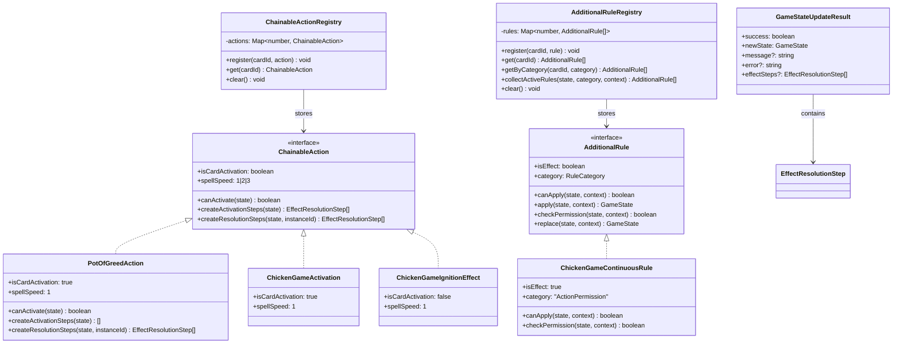

# Effect Model - Data Model Design

**Date**: 2025-01-28  
**Status**: Complete  
**Related**: [research.md](./research.md), [plan.md](./plan.md)

---

## Overview

遊戯王OCG公式ルールに準拠した効果モデルを定義する。効果は以下の2つのモデルに分類される：

1. **ChainableAction**: チェーンブロックを作る処理（カードの発動、効果の発動）
2. **AdditionalRule**: 追加ルール（永続効果、ルール効果、効果外テキスト）

両モデルはRegistry Patternで管理され、O(1)高速ルックアップを実現する。

---

## Entity Definitions

### 1. ChainableAction (チェーン可能な処理)

**責務**: カードの発動と効果の発動を統一的に扱う

**公式ルールとの対応**:
- `canActivate()` → CONDITIONS（発動条件）
- `createActivationSteps()` → ACTIVATION（発動時の処理）
- `createResolutionSteps()` → RESOLUTION（効果の解決）

**Type Definition**:

```typescript
/**
 * ChainableAction - チェーンブロックを作る処理のモデル
 * 
 * File: domain/models/ChainableAction.ts
 */
export interface ChainableAction {
  /**
   * カードの発動 or 効果の発動
   * - true: カードの発動（手札→フィールドへの配置を伴う）
   * - false: 効果の発動（既にフィールドに存在するカードの効果）
   */
  readonly isCardActivation: boolean;

  /**
   * スペルスピード
   * - 1: Normal Spell/Effect (通常魔法、起動効果)
   * - 2: Quick-Play Spell/Effect (速攻魔法、誘発効果、クイックエフェクト)
   * - 3: Counter Trap (カウンター罠)
   * 
   * 注: チェーンシステムはスコープ外だが、将来の拡張のため型定義
   */
  readonly spellSpeed: 1 | 2 | 3;

  /**
   * CONDITIONS: 発動条件チェック
   * 
   * 発動を宣言できるかどうかを判定する。
   * - フェーズチェック（Main Phase Only等）
   * - コスト支払い可否（LPコスト、手札コスト等）
   * - 対象の存在チェック
   * - 1ターンに1度制限（activatedIgnitionEffectsThisTurnで判定）
   * 
   * @param state - 現在のゲーム状態
   * @returns 発動可能ならtrue
   */
  canActivate(state: GameState): boolean;

  /**
   * ACTIVATION: 発動時の処理（即座に実行）
   * 
   * 発動を宣言した瞬間に実行される処理。無効化されても取り消されない。
   * - コスト支払い（LPコスト、手札捨て等）
   * - 対象指定（対象を取る効果の場合）
   * - カード配置（カードの発動の場合）
   * 
   * 注: 通常魔法は即座に実行する処理がないため、空配列を返す
   * 
   * @param state - 現在のゲーム状態
   * @returns 発動時の処理ステップ配列（空配列も可）
   */
  createActivationSteps(state: GameState): EffectResolutionStep[];

  /**
   * RESOLUTION: 効果解決時の処理（チェーン解決時に実行）
   * 
   * チェーン解決時に適用されるメインの処理（狭義の「効果」）。
   * 無効化される可能性がある。
   * - カードドロー
   * - カード破壊
   * - ステータス変更
   * - 特殊召喚
   * - グレーブ送り（通常魔法の場合は最後に自動追加）
   * 
   * @param state - 現在のゲーム状態
   * @param activatedCardInstanceId - 発動したカードのインスタンスID
   * @returns 効果解決時の処理ステップ配列
   */
  createResolutionSteps(state: GameState, activatedCardInstanceId: string): EffectResolutionStep[];
}
```

**Field Details**:

| Field | Type | Description | Example |
|-------|------|-------------|---------|
| `isCardActivation` | boolean | カード発動か効果発動か | Pot of Greed発動: true, チキンレース起動効果: false |
| `spellSpeed` | 1\|2\|3 | スペルスピード | 通常魔法: 1, 速攻魔法: 2, カウンター罠: 3 |
| `canActivate` | method | 発動条件チェック | Main Phase Only, LP >= 1000, etc. |
| `createActivationSteps` | method | 発動時の即座実行 | コスト支払い、対象指定 |
| `createResolutionSteps` | method | 効果解決 | ドロー、破壊、召喚等 |

**Validation Rules**:
- `canActivate()` が false なら、発動不可
- `createActivationSteps()` は即座に実行（無効化されても取り消されない）
- `createResolutionSteps()` はチェーン解決時に実行（無効化可能）

**State Transitions**:
```
1. canActivate() チェック → false なら発動不可
2. createActivationSteps() 実行 → 即座に適用
3. (チェーンシステムはスコープ外)
4. createResolutionSteps() 実行 → 効果解決
```

---

### 2. AdditionalRule (追加ルール)

**責務**: 永続効果、ルール効果、効果外テキストを体系的に扱う

**Type Definition**:

```typescript
/**
 * RuleCategory - 追加ルールのカテゴリ
 * 
 * どの処理に介入するかを定義
 */
export type RuleCategory =
  // データ書き換え系
  | "NameOverride"        // カード名変更（例: ハーピィ・レディ3姉妹）
  | "StatusModifier"      // 攻撃力/守備力変更（例: 団結の力）
  
  // 判定追加・制限追加系
  | "SummonCondition"     // 特殊召喚条件（例: 青眼の究極竜）
  | "SummonPermission"    // 召喚回数制限（例: マジェスペクター）
  | "ActionPermission"    // 行動制限（例: 攻撃不可、効果発動不可、ダメージ無効化）
  | "VictoryCondition"    // 特殊勝利判定（例: エクゾディア）
  
  // 処理置換・処理フック系
  | "ActionReplacement"   // 破壊耐性、身代わり効果（例: スターダスト・ドラゴン）
  | "SelfDestruction";    // 維持コスト、自壊（例: ペンデュラム地帯）

/**
 * RuleContext - ルール適用時のコンテキスト
 * 
 * ルール適用時に必要なパラメータを汎用的に受け渡す
 */
export interface RuleContext {
  /** ダメージ量（ダメージ無効化系で使用） */
  damageAmount?: number;
  
  /** ダメージ対象（"player" | "opponent"） */
  damageTarget?: string;
  
  /** 対象カードインスタンスID（破壊耐性等で使用） */
  targetCardInstanceId?: string;
  
  /** その他の汎用パラメータ */
  [key: string]: unknown;
}

/**
 * AdditionalRule - 追加ルールのモデル
 * 
 * File: domain/models/AdditionalRule.ts
 */
export interface AdditionalRule {
  /**
   * ルール上「効果」にあたるか
   * 
   * - true: 永続効果、分類されない効果（無効化される）
   * - false: 効果外テキスト（無効化されない）
   * 
   * 注: 本specではスコープ外だが、将来の無効化処理実装のため型定義
   */
  readonly isEffect: boolean;

  /**
   * ルールのカテゴリ
   * 
   * どの処理に介入するかを定義する。
   * - データ書き換え系: apply()メソッド使用
   * - 判定追加・制限追加系: checkPermission()メソッド使用
   * - 処理置換・処理フック系: replace()メソッド使用
   */
  readonly category: RuleCategory;

  /**
   * 適用条件チェック
   * 
   * このルールが現在適用可能かを判定する。
   * - カードがフィールドに存在するか
   * - 表側表示か
   * - 特定の条件を満たしているか（LP差分等）
   * 
   * @param state - 現在のゲーム状態
   * @param context - ルール適用コンテキスト
   * @returns 適用可能ならtrue
   */
  canApply(state: GameState, context: RuleContext): boolean;

  /**
   * データ書き換え系（NameOverride, StatusModifier）
   * 
   * カード名、攻撃力/守備力などのデータを直接書き換える。
   * 
   * @param state - 現在のゲーム状態
   * @param context - ルール適用コンテキスト
   * @returns 新しいゲーム状態
   */
  apply?(state: GameState, context: RuleContext): GameState;

  /**
   * 判定追加・制限系（SummonCondition, Permission, VictoryCondition）
   * 
   * 行動の可否を判定する。
   * - 攻撃できるか
   * - 効果を発動できるか
   * - ダメージを受けるか
   * - 勝利条件を満たしたか
   * 
   * @param state - 現在のゲーム状態
   * @param context - ルール適用コンテキスト
   * @returns 許可ならtrue、禁止ならfalse
   */
  checkPermission?(state: GameState, context: RuleContext): boolean;

  /**
   * 処理置換・フック系（ActionReplacement, SelfDestruction）
   * 
   * 処理を別の処理に置き換える。
   * - 破壊される → 破壊されない
   * - 墓地に行く → デッキに戻る
   * - 維持コスト未払い → 自壊
   * 
   * @param state - 現在のゲーム状態
   * @param context - ルール適用コンテキスト
   * @returns 置換後のゲーム状態
   */
  replace?(state: GameState, context: RuleContext): GameState;
}
```

**Method Usage Guide**:

| Method | Category | Purpose | Return Type | Example |
|--------|----------|---------|-------------|---------|
| `apply()` | NameOverride, StatusModifier | データ書き換え | GameState | 攻撃力+1000、カード名変更 |
| `checkPermission()` | Summon/ActionPermission, VictoryCondition | 行動可否判定 | boolean | 攻撃不可、ダメージ無効化 |
| `replace()` | ActionReplacement, SelfDestruction | 処理置換 | GameState | 破壊耐性、身代わり効果 |

**Validation Rules**:
- `canApply()` が false なら、ルール適用不可
- `apply()`, `checkPermission()`, `replace()` はオプショナル（カテゴリに応じて実装）
- 同じカテゴリのルールが複数適用される場合、すべてのルールを評価

---

### 3. GameStateUpdateResult (修正)

**既存の型に effectSteps フィールドを追加**

```typescript
/**
 * GameStateUpdateResult - ゲーム状態更新結果
 * 
 * File: domain/models/GameStateUpdateResult.ts
 * 
 * Domain層のコマンド実行結果を表現。
 * effectStepsフィールドにより、Application層への効果解決委譲が可能。
 */
export interface GameStateUpdateResult {
  /** 成功/失敗フラグ */
  readonly success: boolean;
  
  /** 更新後のゲーム状態 */
  readonly newState: GameState;
  
  /** 成功メッセージ（オプショナル） */
  readonly message?: string;
  
  /** エラーメッセージ（失敗時） */
  readonly error?: string;

  /**
   * 効果解決ステップ（オプショナル）
   * 
   * Domain層がApplication層に効果解決を委譲する際に使用。
   * - ActivateSpellCommand.execute() が effectSteps を返す
   * - GameFacade.activateSpell() が effectResolutionStore.startResolution() を呼ぶ
   * 
   * これにより、Domain層がApplication層の制御フローに依存しない設計を実現。
   */
  readonly effectSteps?: EffectResolutionStep[];
}
```

**Migration Notes**:
- 既存のコマンド（DrawCardCommand, AdvancePhaseCommand等）は effectSteps を返さない（undefined）
- ActivateSpellCommand のみ effectSteps を返す（Phase 3で実装）

---

### 4. GameState (拡張)

**1ターンに1度制限のため、発動履歴フィールドを追加**

```typescript
/**
 * GameState - ゲーム状態
 * 
 * File: domain/models/GameState.ts
 */
export interface GameState {
  // ... 既存フィールド（zones, phase, turn, lp, result等）

  /**
   * 今ターン発動済みの起動効果（1ターンに1度制限用）
   * 
   * Format: `${cardInstanceId}:${effectId}`
   * Example: "card-123:chicken-game-ignition"
   * 
   * - canActivate()で発動可否チェック
   * - createActivationSteps()またはcreateResolutionSteps()で記録
   * - AdvancePhaseCommandでターン終了時にクリア
   */
  readonly activatedIgnitionEffectsThisTurn: ReadonlySet<string>;
}
```

**Default Value**:
```typescript
// GameState初期化時
activatedIgnitionEffectsThisTurn: new Set<string>()
```

**Usage**:
```typescript
// ChickenGameIgnitionEffect.canActivate()
const effectKey = `${this.cardInstanceId}:chicken-game-ignition`;
if (state.activatedIgnitionEffectsThisTurn.has(effectKey)) {
  return false; // 既に発動済み
}

// 発動時に記録
const newState = {
  ...state,
  activatedIgnitionEffectsThisTurn: new Set([
    ...state.activatedIgnitionEffectsThisTurn,
    effectKey,
  ]),
};

// AdvancePhaseCommand.execute() でクリア
const newState = {
  ...state,
  phase: nextPhase,
  activatedIgnitionEffectsThisTurn: new Set(), // ターン終了時にクリア
};
```

---

### 5. Registry Classes

#### ChainableActionRegistry

**責務**: Card ID → ChainableAction のマッピング管理

```typescript
/**
 * ChainableActionRegistry - チェーン可能な処理のレジストリ
 * 
 * File: domain/registries/ChainableActionRegistry.ts
 * 
 * Registry Pattern + Strategy Pattern
 * - O(1) 高速ルックアップ（Map使用）
 * - 効果の登録・取得をシンプルに
 */
export class ChainableActionRegistry {
  private static actions = new Map<number, ChainableAction>();

  /**
   * 効果を登録
   * 
   * @param cardId - カードID（Card Data ID）
   * @param action - チェーン可能な処理
   */
  static register(cardId: number, action: ChainableAction): void {
    this.actions.set(cardId, action);
  }

  /**
   * 効果を取得
   * 
   * @param cardId - カードID
   * @returns ChainableAction（未登録の場合はundefined）
   */
  static get(cardId: number): ChainableAction | undefined {
    return this.actions.get(cardId);
  }

  /**
   * レジストリをクリア（テスト用）
   */
  static clear(): void {
    this.actions.clear();
  }

  /**
   * 登録済みカードIDの一覧を取得（デバッグ用）
   */
  static getRegisteredCardIds(): number[] {
    return Array.from(this.actions.keys());
  }
}
```

**Initialization**:
```typescript
// domain/effects/index.ts または application 層の初期化処理
import { ChainableActionRegistry } from "$lib/domain/registries/ChainableActionRegistry";
import { PotOfGreedAction } from "$lib/domain/effects/chainable/PotOfGreedAction";
import { ChickenGameActivation } from "$lib/domain/effects/chainable/ChickenGameActivation";

// Pot of Greed
ChainableActionRegistry.register(55144522, new PotOfGreedAction());

// Chicken Game - カード発動
ChainableActionRegistry.register(67616300, new ChickenGameActivation());
```

#### AdditionalRuleRegistry

**責務**: Card ID → AdditionalRule[] のマッピング管理（1カードに複数ルール可）

```typescript
/**
 * AdditionalRuleRegistry - 追加ルールのレジストリ
 * 
 * File: domain/registries/AdditionalRuleRegistry.ts
 * 
 * Registry Pattern
 * - 1枚のカードに複数のルールを登録可能
 * - カテゴリ別フィルタ機能
 * - フィールド全体から適用可能なルールを収集
 */
export class AdditionalRuleRegistry {
  private static rules = new Map<number, AdditionalRule[]>();

  /**
   * ルールを登録
   * 
   * @param cardId - カードID
   * @param rule - 追加ルール
   */
  static register(cardId: number, rule: AdditionalRule): void {
    const existing = this.rules.get(cardId) || [];
    this.rules.set(cardId, [...existing, rule]);
  }

  /**
   * カードIDから全ルールを取得
   * 
   * @param cardId - カードID
   * @returns AdditionalRule配列（未登録の場合は空配列）
   */
  static get(cardId: number): AdditionalRule[] {
    return this.rules.get(cardId) || [];
  }

  /**
   * カテゴリ別フィルタ
   * 
   * @param cardId - カードID
   * @param category - ルールカテゴリ
   * @returns 該当カテゴリのルール配列
   */
  static getByCategory(cardId: number, category: RuleCategory): AdditionalRule[] {
    const allRules = this.get(cardId);
    return allRules.filter(rule => rule.category === category);
  }

  /**
   * フィールド全体から適用可能なルールを収集
   * 
   * フィールド上のすべてのカードをチェックし、
   * 指定カテゴリのルールで canApply() が true のものを収集する。
   * 
   * @param state - 現在のゲーム状態
   * @param category - ルールカテゴリ
   * @param context - ルール適用コンテキスト
   * @returns 適用可能なルール配列
   */
  static collectActiveRules(
    state: GameState,
    category: RuleCategory,
    context: RuleContext = {}
  ): AdditionalRule[] {
    const activeRules: AdditionalRule[] = [];

    // フィールド上のすべてのカードをチェック
    for (const card of state.zones.field) {
      // 表側表示のカードのみチェック
      if (card.position !== "faceUp") continue;

      const cardRules = this.getByCategory(card.id, category);
      for (const rule of cardRules) {
        if (rule.canApply(state, context)) {
          activeRules.push(rule);
        }
      }
    }

    return activeRules;
  }

  /**
   * レジストリをクリア（テスト用）
   */
  static clear(): void {
    this.rules.clear();
  }

  /**
   * 登録済みカードIDの一覧を取得（デバッグ用）
   */
  static getRegisteredCardIds(): number[] {
    return Array.from(this.rules.keys());
  }
}
```

**Initialization**:
```typescript
// domain/effects/index.ts
import { AdditionalRuleRegistry } from "$lib/domain/registries/AdditionalRuleRegistry";
import { ChickenGameContinuousRule } from "$lib/domain/effects/additional/ChickenGameContinuousRule";

// Chicken Game - 永続効果（ダメージ無効化）
AdditionalRuleRegistry.register(67616300, new ChickenGameContinuousRule());
```

---

### 6. Chicken Game (チキンレース) - Entity Details

**Card Data**:

```typescript
// CardDataRegistry に登録
{
  id: 67616300,
  name: "Chicken Game",
  nameJa: "チキンレース",
  type: "Spell",
  frameType: "spell",
  race: "Field",
  desc: "相手よりLPが少ないプレイヤーが受けるダメージは0になる。" +
        "①：1ターンに1度、1000LPを払って以下の効果から1つを選択して発動できる。" +
        "この効果の発動に対して、お互いに魔法・罠・モンスターの効果を発動できない。" +
        "●デッキから1枚ドローする。" +
        "●このカードを破壊する。" +
        "●相手は1000LP回復する。"
}
```

**ChainableAction Implementation**:

1. **ChickenGameActivation** (カードの発動)
   - `isCardActivation`: true
   - `spellSpeed`: 1
   - `canActivate()`: フィールド魔法ゾーンが空か
   - `createActivationSteps()`: カードをフィールドに配置
   - `createResolutionSteps()`: なし（フィールド魔法は発動と同時に適用）

2. **ChickenGameIgnitionEffect** (起動効果)
   - `isCardActivation`: false
   - `spellSpeed`: 1
   - `canActivate()`: Main Phase, LP >= 1000, 1ターンに1度チェック
   - `createActivationSteps()`: 1000LP支払い、選択肢提示
   - `createResolutionSteps()`: ドロー/破壊/回復のいずれか

**AdditionalRule Implementation**:

**ChickenGameContinuousRule** (永続効果)
- `isEffect`: true
- `category`: "ActionPermission"
- `canApply()`: チキンレースがフィールドに存在 && LP差分チェック
- `checkPermission()`: ダメージ禁止（false を返す）

**Relationships**:

```
Chicken Game (Card ID: 67616300)
├── ChainableActionRegistry
│   ├── ChickenGameActivation (カードの発動)
│   └── ChickenGameIgnitionEffect (起動効果)
└── AdditionalRuleRegistry
    └── ChickenGameContinuousRule (永続効果)
```

---

## Entity Relationships



---

## Summary

### Key Entities

1. **ChainableAction**: 公式ルールの3ステップ構成（CONDITIONS/ACTIVATION/RESOLUTION）
2. **AdditionalRule**: カテゴリ別（データ書き換え/判定/置換）の3種類のメソッド
3. **GameStateUpdateResult**: effectStepsフィールドでApplication層に委譲
4. **Registry Classes**: O(1)高速ルックアップ、カテゴリフィルタ、フィールド全体収集
5. **Chicken Game**: 3つの実装（発動、起動効果、永続効果）で効果モデルを検証

### Validation Rules

- ChainableAction: canActivate() → createActivationSteps() → createResolutionSteps()
- AdditionalRule: canApply() → apply()/checkPermission()/replace()
- GameState: activatedIgnitionEffectsThisTurn でターン制限管理

### Next Steps

- contracts/ 生成
- quickstart.md 作成
- Phase 2以降のタスク分解（/speckit.tasks）
