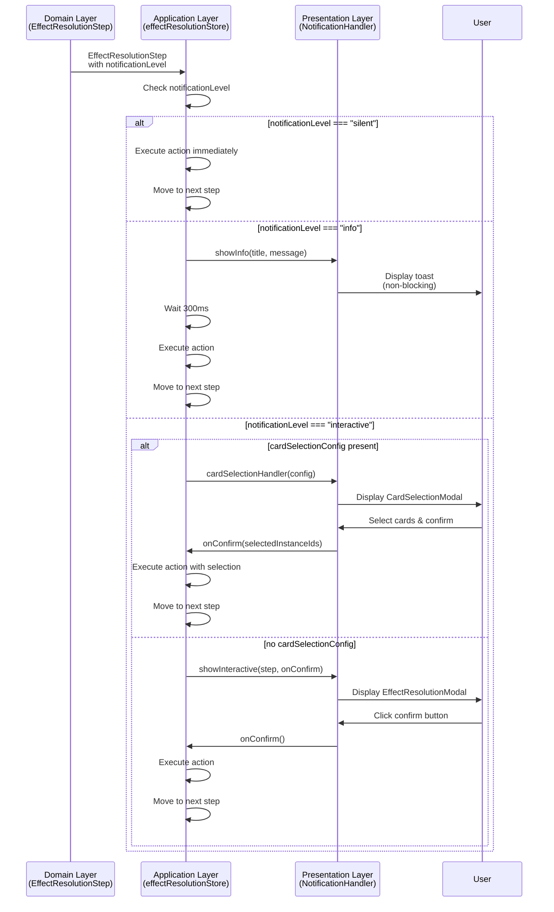

# Data Model: Effect Resolution Notification Control

**Date**: 2025-12-30
**Status**: Complete
**Related**: [plan.md](./plan.md), [research.md](./research.md)

---

## Overview

このドキュメントは、Notification Level Control機能のデータモデル設計を定義する。Clean Architectureの原則に従い、Domain層で通知レベルを定義し、Application層でハンドラインターフェースを定義し、Presentation層で実装を提供する。

---

## Entity Definitions

### 1. NotificationLevel (Domain Layer)

**Type**: String literal union type

**Definition**:
```typescript
/**
 * NotificationLevel - 効果解決ステップの通知レベル
 *
 * Domain層で定義され、Presentation層が表示方法を決定する。
 * Clean Architectureの原則に従い、UI実装詳細（toast/modal）をDomain層から分離。
 *
 * @module domain/models/EffectResolutionStep
 */
export type NotificationLevel =
  | "silent"       // 通知なし（内部状態変更のみ）
  | "info"         // 情報通知（非ブロッキング）
  | "interactive"; // ユーザー入力要求（ブロッキング）
```

**Field Details**:

| Value | Description | UI Presentation | Use Case |
|-------|-------------|-----------------|----------|
| `"silent"` | 通知UI非表示、効果は即座に実行 | なし | 永続効果適用、カウンター更新 |
| `"info"` | 情報通知、自動進行 | トースト（非ブロッキング） | カードドロー、墓地送り、LP変更 |
| `"interactive"` | ユーザー入力待ち | モーダル（ブロッキング） | カード選択、対象指定 |

**Validation Rules**:
- NotificationLevel型の値は3つのリテラルのいずれか
- デフォルト値は`"info"`（未指定時の後方互換性）

**Design Rationale**:
- String literal型により型安全性を保証
- enumではなくunion型を採用（バンドルサイズ削減、import不要）
- 将来的な拡張性を考慮（新しいレベル追加が容易）

---

### 2. EffectResolutionStep (Domain Layer - Extended)

**Type**: Interface

**Definition**:
```typescript
/**
 * EffectResolutionStep - 効果解決ステップ（拡張版）
 *
 * notificationLevelプロパティを追加（オプショナル）
 * 未指定の場合は "info" として扱う（後方互換性）
 *
 * @module domain/models/EffectResolutionStep
 */
export interface EffectResolutionStep {
  /** Unique identifier for this step */
  readonly id: string;

  /** Title displayed to user */
  readonly title: string;

  /** Detailed message displayed to user */
  readonly message: string;

  /**
   * Notification level (optional)
   *
   * Controls how this step's notification is presented to the user.
   * If not specified, defaults to "info" for backward compatibility.
   *
   * - "silent": No notification, step executes immediately
   * - "info": Toast notification, non-blocking, auto-proceeds
   * - "interactive": Modal notification, blocking, requires user input
   */
  readonly notificationLevel?: NotificationLevel;

  /**
   * Card selection configuration (optional)
   *
   * If provided, Application Layer will open CardSelectionModal before executing action.
   * Steps with cardSelectionConfig should typically have notificationLevel: "interactive"
   */
  readonly cardSelectionConfig?: CardSelectionConfig;

  /**
   * Action callback executed when step is confirmed
   *
   * @param state - Current game state (injected by Application Layer)
   * @param selectedInstanceIds - Selected card instance IDs (if cardSelectionConfig present)
   * @returns GameStateUpdateResult with new state
   */
  action: (state: GameState, selectedInstanceIds?: string[]) => GameStateUpdateResult;

  /** Whether to show cancel button (optional) */
  readonly showCancel?: boolean;
}
```

**Field Additions**:

| Field | Type | Optional | Default | Description |
|-------|------|----------|---------|-------------|
| `notificationLevel` | NotificationLevel | Yes | `"info"` | 通知レベル（silent/info/interactive） |

**Backward Compatibility**:
- `notificationLevel`プロパティはオプショナル
- 既存のEffectResolutionStepはnotificationLevel未指定で動作
- 未指定の場合は`"info"`として扱う（Application層で`?? "info"`）

**Validation Rules**:
- `cardSelectionConfig`が存在する場合、`notificationLevel`は`"interactive"`であるべき
- `notificationLevel: "silent"`の場合、`title`と`message`は無視される（通知非表示）

**State Transitions**:
```
EffectResolutionStep with notificationLevel
  → Application Layer: effectResolutionStore.confirmCurrentStep()
  → notificationLevel判定
    ├─ "silent": action即座実行 → 次ステップ
    ├─ "info": NotificationHandler.showInfo() → action実行 → 次ステップ
    └─ "interactive": NotificationHandler.showInteractive() → ユーザー入力待ち → action実行 → 次ステップ
```

---

### 3. NotificationHandler (Application Layer)

**Type**: Interface

**Definition**:
```typescript
/**
 * NotificationHandler - 通知ハンドラインターフェース
 *
 * Application層で定義され、Presentation層が実装を提供する。
 * Dependency Injectionパターンにより、UI実装詳細をApplication層から分離。
 *
 * @module application/stores/effectResolutionStore
 */
export interface NotificationHandler {
  /**
   * Show informational notification (non-blocking)
   *
   * Typically implemented as a toast notification that auto-dismisses.
   * Should not block effect resolution flow.
   *
   * @param title - Notification title
   * @param message - Notification message
   */
  showInfo(title: string, message: string): void;

  /**
   * Show interactive notification (blocking)
   *
   * Typically implemented as a modal dialog that requires user confirmation.
   * Should block effect resolution flow until user responds.
   *
   * @param step - Effect resolution step to display
   * @param onConfirm - Callback invoked when user confirms
   * @param onCancel - Callback invoked when user cancels (optional)
   */
  showInteractive(
    step: EffectResolutionStep,
    onConfirm: () => void,
    onCancel?: () => void
  ): void;
}
```

**Method Details**:

#### showInfo()

| Parameter | Type | Description |
|-----------|------|-------------|
| `title` | string | 通知タイトル（例: "カードをドローします"） |
| `message` | string | 通知メッセージ（例: "デッキから2枚ドローします"） |

**Behavior**:
- 非ブロッキング表示（トースト）
- 自動消去（デフォルト3秒）
- 効果解決は自動進行

#### showInteractive()

| Parameter | Type | Description |
|-----------|------|-------------|
| `step` | EffectResolutionStep | 効果解決ステップ全体 |
| `onConfirm` | () => void | 確認ボタン押下時のコールバック |
| `onCancel?` | () => void | キャンセルボタン押下時のコールバック（オプショナル） |

**Behavior**:
- ブロッキング表示（モーダル）
- ユーザー入力待ち
- 確認またはキャンセルまで効果解決は停止

**Design Rationale**:
- CardSelectionHandlerと同じDependency Injectionパターン
- showInfo()とshowInteractive()の2メソッドで責務明確
- Presentation層が具体的な表示方法（toast/modal）を決定

---

### 4. EffectResolutionState (Application Layer - Extended)

**Type**: Interface

**Definition**:
```typescript
/**
 * EffectResolutionState - 効果解決ストアの状態（拡張版）
 *
 * notificationHandlerフィールドを追加
 *
 * @module application/stores/effectResolutionStore
 */
interface EffectResolutionState {
  /** Whether effect resolution is currently active */
  isActive: boolean;

  /** Current step being resolved */
  currentStep: EffectResolutionStep | null;

  /** All steps in the resolution sequence */
  steps: EffectResolutionStep[];

  /** Current step index */
  currentIndex: number;

  /** Card selection handler (Dependency Injection) */
  cardSelectionHandler: CardSelectionHandler | null;

  /**
   * Notification handler (Dependency Injection) - NEW
   *
   * Injected by Presentation Layer during initialization.
   * Used to display notifications based on step's notificationLevel.
   */
  notificationHandler: NotificationHandler | null;
}
```

**Field Additions**:

| Field | Type | Optional | Default | Description |
|-------|------|----------|---------|-------------|
| `notificationHandler` | NotificationHandler \| null | No | `null` | 通知ハンドラ（Dependency Injection） |

**Initialization**:
```typescript
const { subscribe, update } = writable<EffectResolutionState>({
  isActive: false,
  currentStep: null,
  steps: [],
  currentIndex: -1,
  cardSelectionHandler: null,
  notificationHandler: null, // NEW
});
```

**Registration Method**:
```typescript
/**
 * Register NotificationHandler (Dependency Injection)
 * Called by Presentation Layer during initialization
 */
registerNotificationHandler: (handler: NotificationHandler) => {
  update((state) => ({
    ...state,
    notificationHandler: handler,
  }));
}
```

---

## Process Flow

### Effect Resolution Flow with Notification Levels



### confirmCurrentStep() Implementation Logic

```typescript
confirmCurrentStep: async () => {
  const state = get(effectResolutionStore);
  if (!state.currentStep) return;

  const currentGameState = get(gameStateStore);
  const notificationLevel = state.currentStep.notificationLevel ?? "info";

  // Helper: Execute action and update game state
  const executeAction = (selectedInstanceIds?: string[]) => {
    const result = state.currentStep!.action(currentGameState, selectedInstanceIds);
    if (result.success) {
      gameStateStore.set(result.newState);
    }
  };

  // Helper: Move to next step
  const moveToNextStep = () => {
    const nextIndex = state.currentIndex + 1;
    if (nextIndex < state.steps.length) {
      update((s) => ({
        ...s,
        currentIndex: nextIndex,
        currentStep: s.steps[nextIndex],
      }));
    } else {
      // All steps completed
      update((s) => ({
        ...s,
        isActive: false,
        currentStep: null,
        steps: [],
        currentIndex: -1,
      }));
    }
  };

  // 1. silent: No notification, execute immediately
  if (notificationLevel === "silent") {
    executeAction();
    moveToNextStep();
    return;
  }

  // 2. info: Toast notification, auto-proceed
  if (notificationLevel === "info") {
    state.notificationHandler?.showInfo(
      state.currentStep.title,
      state.currentStep.message
    );

    // Wait 300ms for toast visibility
    await new Promise(resolve => setTimeout(resolve, 300));

    executeAction();
    moveToNextStep();
    return;
  }

  // 3. interactive: Modal notification, wait for user input
  if (notificationLevel === "interactive") {
    // If cardSelectionConfig present, use existing CardSelectionModal flow
    if (state.currentStep.cardSelectionConfig) {
      return new Promise<void>((resolve) => {
        state.cardSelectionHandler!({
          ...state.currentStep!.cardSelectionConfig!,
          availableCards: currentGameState.zones.hand,
          onConfirm: (selectedInstanceIds: string[]) => {
            executeAction(selectedInstanceIds);
            moveToNextStep();
            resolve();
          },
          onCancel: () => {
            // Cancel resolution
            update((s) => ({
              ...s,
              isActive: false,
              currentStep: null,
              steps: [],
              currentIndex: -1,
            }));
            resolve();
          },
        });
      });
    } else {
      // No cardSelectionConfig, use generic interactive modal
      state.notificationHandler?.showInteractive(
        state.currentStep,
        () => {
          // onConfirm
          executeAction();
          moveToNextStep();
        },
        state.currentStep.showCancel ? () => {
          // onCancel
          update((s) => ({
            ...s,
            isActive: false,
            currentStep: null,
            steps: [],
            currentIndex: -1,
          }));
        } : undefined
      );
    }
    return;
  }
};
```

---

## Migration Strategy

### Existing Card Effects Migration

#### Pot of Greed (強欲な壺)

**Before**:
```typescript
createResolutionSteps(state: GameState, activatedCardInstanceId: string): EffectResolutionStep[] {
  return [
    {
      id: "pot-of-greed-draw",
      title: "カードをドローします",
      message: "デッキから2枚ドローします",
      action: (currentState: GameState) => { ... }
    },
    {
      id: "pot-of-greed-graveyard",
      title: "カードを墓地に送ります",
      message: "強欲な壺を墓地に送ります",
      action: (currentState: GameState) => { ... }
    }
  ];
}
```

**After**:
```typescript
createResolutionSteps(state: GameState, activatedCardInstanceId: string): EffectResolutionStep[] {
  return [
    {
      id: "pot-of-greed-draw",
      title: "カードをドローします",
      message: "デッキから2枚ドローします",
      notificationLevel: "info", // NEW
      action: (currentState: GameState) => { ... }
    },
    {
      id: "pot-of-greed-graveyard",
      title: "カードを墓地に送ります",
      message: "強欲な壺を墓地に送ります",
      notificationLevel: "info", // NEW
      action: (currentState: GameState) => { ... }
    }
  ];
}
```

**Impact**: モーダル2回 → トースト2回（非ブロッキング）

#### Graceful Charity (天使の施し)

**Before**:
```typescript
createResolutionSteps(state: GameState, activatedCardInstanceId: string): EffectResolutionStep[] {
  return [
    {
      id: "graceful-charity-draw",
      title: "カードをドローします",
      message: "デッキから3枚ドローします",
      action: (currentState: GameState) => { ... }
    },
    {
      id: "graceful-charity-discard",
      title: "カードを破棄します",
      message: "手札から2枚選んで破棄してください",
      cardSelectionConfig: { ... },
      action: (currentState: GameState, selectedInstanceIds?: string[]) => { ... }
    },
    {
      id: "graceful-charity-graveyard",
      title: "カードを墓地に送ります",
      message: "天使の施しを墓地に送ります",
      action: (currentState: GameState) => { ... }
    }
  ];
}
```

**After**:
```typescript
createResolutionSteps(state: GameState, activatedCardInstanceId: string): EffectResolutionStep[] {
  return [
    {
      id: "graceful-charity-draw",
      title: "カードをドローします",
      message: "デッキから3枚ドローします",
      notificationLevel: "info", // NEW
      action: (currentState: GameState) => { ... }
    },
    {
      id: "graceful-charity-discard",
      title: "カードを破棄します",
      message: "手札から2枚選んで破棄してください",
      notificationLevel: "interactive", // NEW
      cardSelectionConfig: { ... },
      action: (currentState: GameState, selectedInstanceIds?: string[]) => { ... }
    },
    {
      id: "graceful-charity-graveyard",
      title: "カードを墓地に送ります",
      message: "天使の施しを墓地に送ります",
      notificationLevel: "info", // NEW
      action: (currentState: GameState) => { ... }
    }
  ];
}
```

**Impact**: モーダル3回 → トースト2回 + モーダル1回（カード選択）

### Backward Compatibility

**Existing steps without notificationLevel**:
```typescript
// notificationLevel未指定
{
  id: "legacy-step",
  title: "Legacy Step",
  message: "This step has no notificationLevel",
  action: (state) => ({ success: true, newState: state })
}

// effectResolutionStore内で自動的に"info"として扱う
const notificationLevel = state.currentStep.notificationLevel ?? "info";
// → notificationLevel === "info" として処理される
```

---

## Testing Strategy

### Unit Tests

**effectResolutionStore.test.ts** (追加テスト):

```typescript
describe("effectResolutionStore - NotificationHandler", () => {
  beforeEach(() => {
    effectResolutionStore.reset();
  });

  it("should register NotificationHandler via DI", () => {
    const mockHandler: NotificationHandler = {
      showInfo: vi.fn(),
      showInteractive: vi.fn(),
    };

    effectResolutionStore.registerNotificationHandler(mockHandler);

    // 検証: ハンドラが登録されたことを確認
    // (storeの内部状態を直接検証するのは難しいため、実際の使用で検証)
  });

  it("should call showInfo for info level steps", async () => {
    const mockHandler: NotificationHandler = {
      showInfo: vi.fn(),
      showInteractive: vi.fn(),
    };

    effectResolutionStore.registerNotificationHandler(mockHandler);

    const infoStep: EffectResolutionStep = {
      id: "test-info",
      title: "Info Step",
      message: "This is info",
      notificationLevel: "info",
      action: (state) => ({ success: true, newState: state }),
    };

    effectResolutionStore.startResolution([infoStep]);
    await effectResolutionStore.confirmCurrentStep();

    expect(mockHandler.showInfo).toHaveBeenCalledWith("Info Step", "This is info");
  });

  it("should not show notification for silent level steps", async () => {
    const mockHandler: NotificationHandler = {
      showInfo: vi.fn(),
      showInteractive: vi.fn(),
    };

    effectResolutionStore.registerNotificationHandler(mockHandler);

    const silentStep: EffectResolutionStep = {
      id: "test-silent",
      title: "Silent Step",
      message: "This is silent",
      notificationLevel: "silent",
      action: (state) => ({ success: true, newState: state }),
    };

    effectResolutionStore.startResolution([silentStep]);
    await effectResolutionStore.confirmCurrentStep();

    expect(mockHandler.showInfo).not.toHaveBeenCalled();
    expect(mockHandler.showInteractive).not.toHaveBeenCalled();
  });

  it("should call showInteractive for interactive level steps", async () => {
    const mockHandler: NotificationHandler = {
      showInfo: vi.fn(),
      showInteractive: vi.fn(),
    };

    effectResolutionStore.registerNotificationHandler(mockHandler);

    const interactiveStep: EffectResolutionStep = {
      id: "test-interactive",
      title: "Interactive Step",
      message: "This is interactive",
      notificationLevel: "interactive",
      action: (state) => ({ success: true, newState: state }),
    };

    effectResolutionStore.startResolution([interactiveStep]);
    await effectResolutionStore.confirmCurrentStep();

    expect(mockHandler.showInteractive).toHaveBeenCalled();
  });

  it("should default to info level for steps without notificationLevel", async () => {
    const mockHandler: NotificationHandler = {
      showInfo: vi.fn(),
      showInteractive: vi.fn(),
    };

    effectResolutionStore.registerNotificationHandler(mockHandler);

    const legacyStep: EffectResolutionStep = {
      id: "test-legacy",
      title: "Legacy Step",
      message: "This is legacy (no notificationLevel)",
      // notificationLevel未指定
      action: (state) => ({ success: true, newState: state }),
    };

    effectResolutionStore.startResolution([legacyStep]);
    await effectResolutionStore.confirmCurrentStep();

    // デフォルト"info"として扱われる
    expect(mockHandler.showInfo).toHaveBeenCalledWith("Legacy Step", "This is legacy (no notificationLevel)");
  });
});
```

### Integration Tests

**notification-level-control.test.ts** (新規):

```typescript
describe("Notification Level Control - Integration", () => {
  it("should display toast for Pot of Greed effect resolution", async () => {
    // Pot of Greedを発動
    // 2つのinfoステップ（draw, graveyard）がトースト表示されることを検証
  });

  it("should display modal for Graceful Charity card selection", async () => {
    // Graceful Charityを発動
    // drawステップ: トースト
    // discardステップ: モーダル（カード選択）
    // graveyardステップ: トースト
    // の順序で表示されることを検証
  });

  it("should handle mixed notification levels in effect chain", async () => {
    // silent → info → interactive の混合効果チェーン
    // 各レベルの通知が正しく表示されることを検証
  });
});
```

---

## References

- [plan.md](./plan.md)
- [research.md](./research.md)
- [EffectResolutionStep.ts](../../skeleton-app/src/lib/domain/models/EffectResolutionStep.ts)
- [effectResolutionStore.ts](../../skeleton-app/src/lib/application/stores/effectResolutionStore.ts)
- [CardSelectionHandler pattern](../../skeleton-app/src/lib/application/stores/effectResolutionStore.ts#L10-L20)
