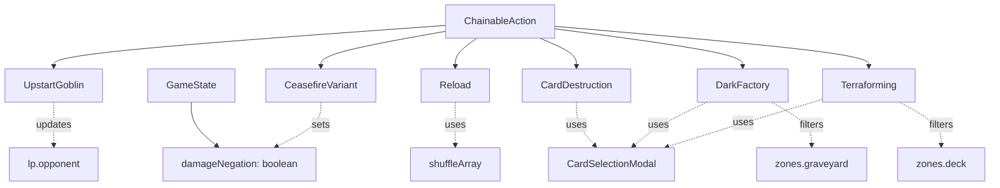

# Data Model: Card Pool Expansion - 6 New Spell Cards

**Feature**: 011-card-pool-expansion
**Date**: 2025-12-30
**Status**: Complete

## Overview

6枚の新規通常魔法・速攻魔法カードのデータモデル定義と、GameState拡張（damageNegationフィールド追加）。

---

## Entities

### 1. UpstartGoblin (成金ゴブリン)

**Type**: ChainableAction (通常魔法)

**Card Data**:
- ID: 70368879
- Name: "Upstart Goblin" / "成金ゴブリン"
- Type: "Spell"
- FrameType: "spell"
- Description: "デッキから1枚ドローする。その後、相手は1000LP回復する。"

**Behavior**:
- canActivate: Main Phase 1, deck.length >= 1, !result.isGameOver
- spellSpeed: 1
- Resolution Steps:
  1. Draw 1 card
  2. Opponent gains 1000 LP
  3. Send spell card to graveyard

**Validation Rules**:
- Deck must have at least 1 card

---

### 2. CeasefireVariant (一時休戦)

**Type**: ChainableAction (通常魔法)

**Card Data**:
- ID: 33782437
- Name: "Ceasefire" / "一時休戦" (注: 原作カード名は異なるが、効果は一時休戦に類似)
- Type: "Spell"
- FrameType: "spell"
- Description: "お互いのプレイヤーは、それぞれデッキから1枚ドローする。次の相手ターン終了時まで、お互いが受ける全てのダメージは0になる。"

**Behavior**:
- canActivate: Main Phase 1, deck.length >= 1, !result.isGameOver
- spellSpeed: 1
- Resolution Steps:
  1. Player draws 1 card
  2. Opponent draws 1 card (internal state only, no UI)
  3. Set `damageNegation: true`
  4. Send spell card to graveyard

**Validation Rules**:
- Deck must have at least 1 card

---

### 3. Reload (打ち出の小槌)

**Type**: ChainableAction (通常魔法)

**Card Data**:
- ID: 85852291
- Name: "Reload" / "打ち出の小槌"
- Type: "Spell"
- FrameType: "spell"
- Description: "自分の手札を任意の数だけデッキに戻してシャッフルする。その後、自分はデッキに戻した数だけドローする。"

**Behavior**:
- canActivate: Main Phase 1, !result.isGameOver
- spellSpeed: 1
- Resolution Steps:
  1. Player selects 0 to hand.length cards (CardSelectionModal: minCards=0, maxCards=hand.length)
  2. Return selected cards to deck
  3. Shuffle deck (shuffleArray)
  4. Draw same number of cards
  5. Send spell card to graveyard

**Validation Rules**:
- If 0 cards selected, skip return/shuffle/draw (no-op)
- If all cards selected, ensure correct draw after shuffle

**Edge Cases**:
- 0枚選択時: 何もしない（デッキ戻しもドローもなし）
- 全カード選択時: 手札全消失→シャッフル→ドロー成功

---

### 4. CardDestruction (手札断札)

**Type**: ChainableAction (速攻魔法)

**Card Data**:
- ID: 74519184
- Name: "Card Destruction" / "手札断札"
- Type: "Spell"
- FrameType: "spell"
- Description: "お互いのプレイヤーは手札を2枚墓地へ送る。その後、それぞれデッキから2枚ドローする。"

**Behavior**:
- canActivate: Main Phase 1, hand.length >= 3 (spell card + 2 cards to discard), !result.isGameOver
- spellSpeed: 2 (速攻魔法)
- Resolution Steps:
  1. Player discards 2 cards (CardSelectionModal: minCards=2, maxCards=2, cancelable=false)
  2. Opponent discards 2 cards (internal state only)
  3. Player draws 2 cards
  4. Opponent draws 2 cards (internal state only)
  5. Send spell card to graveyard

**Validation Rules**:
- Hand must have at least 3 cards (spell + 2 to discard)

---

### 5. DarkFactory (闇の量産工場)

**Type**: ChainableAction (通常魔法)

**Card Data**:
- ID: 90928333
- Name: "Dark Factory of Mass Production" / "闇の量産工場"
- Type: "Spell"
- FrameType: "spell"
- Description: "自分の墓地の通常モンスター2体を対象として発動できる。そのモンスターを手札に加える。"

**Behavior**:
- canActivate: Main Phase 1, graveyard has >= 2 Normal Monsters, !result.isGameOver
- spellSpeed: 1
- Resolution Steps:
  1. Filter graveyard for Normal Monsters (CardData.type === "Normal Monster")
  2. Player selects 2 monsters (CardSelectionModal: minCards=2, maxCards=2, availableCards=filteredGraveyard, cancelable=false)
  3. Move selected monsters from graveyard to hand
  4. Send spell card to graveyard

**Validation Rules**:
- Graveyard must have at least 2 Normal Monsters

---

### 6. Terraforming (テラフォーミング)

**Type**: ChainableAction (通常魔法)

**Card Data**:
- ID: 73628505
- Name: "Terraforming" / "テラフォーミング"
- Type: "Spell"
- FrameType: "spell"
- Description: "デッキからフィールド魔法カード1枚を手札に加える。"

**Behavior**:
- canActivate: Main Phase 1, deck has >= 1 Field Spell, !result.isGameOver
- spellSpeed: 1
- Resolution Steps:
  1. Filter deck for Field Spells (CardData.type === "Spell" && CardData.frameType === "spell_field")
  2. Player selects 1 Field Spell (CardSelectionModal: minCards=1, maxCards=1, availableCards=filteredDeck, cancelable=false)
  3. Move selected Field Spell from deck to hand
  4. Send spell card to graveyard

**Validation Rules**:
- Deck must have at least 1 Field Spell card

---

## GameState Extensions

### Existing Fields (No changes)

```typescript
interface GameState {
  readonly zones: Zones;
  readonly lp: LifePoints; // lp.opponent for Upstart Goblin
  readonly phase: GamePhase;
  readonly turn: number;
  readonly chainStack: readonly ChainBlock[];
  readonly result: GameResult;
  readonly activatedIgnitionEffectsThisTurn: ReadonlySet<string>;
}
```

### New Fields

```typescript
interface GameState {
  // ... existing fields

  /**
   * ダメージ無効化フラグ（一時休戦効果用）
   * true: すべてのダメージが0になる
   * false: 通常のダメージ計算
   *
   * Note: 現在はダメージ計算システム未実装のため、将来の拡張に備えた定義
   */
  readonly damageNegation: boolean;
}
```

**Default Value**: `false`

**Rationale**:
- 一時休戦の「次の相手ターン終了時までダメージ0」効果を実現
- 相手ターンが存在しないため、永続効果として簡易実装
- 将来のダメージ計算システム実装時に、AdditionalRuleとして再実装を検討

---

## Zone Helper Functions (Existing)

### moveCard (既存実装を活用)

```typescript
function moveCard(
  zones: Zones,
  instanceId: string,
  from: keyof Zones,
  to: keyof Zones,
  position?: "faceUp" | "faceDown",
): Zones
```

**Usage**:
- 闇の量産工場: `moveCard(zones, instanceId, "graveyard", "hand")`
- テラフォーミング: `moveCard(zones, instanceId, "deck", "hand")`

### shuffleDeck (新規作成)

```typescript
function shuffleDeck(zones: Zones): Zones {
  return {
    ...zones,
    deck: shuffleArray(zones.deck),
  };
}
```

**Usage**:
- 打ち出の小槌: デッキに戻した後にシャッフル

---

## Relationships



---

## Summary

- **New Entities**: 6 ChainableAction implementations
- **GameState Extensions**: `damageNegation: boolean` field
- **Zone Operations**: 既存`moveCard`関数活用、新規`shuffleDeck`ヘルパー関数
- **Card Selection**: 既存CardSelectionModal活用（墓地/デッキからの選択も対応）
- **Type Filtering**: CardDataRegistryの`type`/`frameType`で実現
