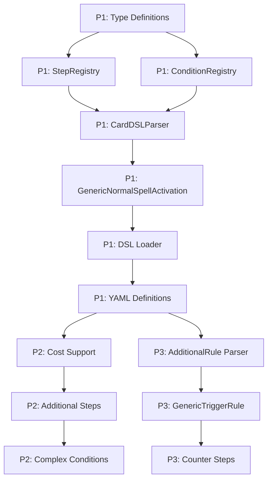

# Implementation Plan: Card Definition DSL

**Branch**: `018-card-definition-dsl` | **Date**: 2026-02-28 | **Spec**: [spec.md](spec.md)
**Input**: Feature specification from `/specs/018-card-definition-dsl/spec.md`

## Summary

カード定義をYAML形式のDSL（Domain Specific Language）で宣言的に記述し、個別のTypeScriptクラスを量産せずにカードを追加できるようにする。既存のAtomicStepビルダー関数（`drawStep`, `selectAndDiscardStep`等）をDSLから参照可能なStepRegistryにマッピングし、GenericSpellActivation等の汎用クラスがDSL定義を注入して動作する構成とする。

## Technical Context

**Language/Version**: TypeScript 5.0 (ES2022)
**Primary Dependencies**: SvelteKit 2, Svelte 5 (Runes mode), Immer.js, js-yaml
**Storage**: N/A (フロントエンドのみ、状態はメモリ内)
**Testing**: Vitest (unit testing), Playwright (E2E testing)
**Target Platform**: Web (SPA, GitHub Pages)
**Project Type**: Single project (skeleton-app/)
**Performance Goals**: N/A（ゲームシミュレータ、リアルタイム性は不要）
**Constraints**: 既存のAtomicStepビルダーとベースクラスは変更しない
**Scale/Scope**: 13個の既存Spell Activationのうち80%以上（10個以上）をDSLで再実装

## Constitution Check

_GATE: Must pass before Phase 0 research. Re-check after Phase 1 design._

| Principle | Status | Notes |
|-----------|--------|-------|
| I. 目的と手段の分離 | PASS | 目的: カード追加の効率化。手段: DSLによる宣言的定義 |
| II. 段階的な理解の深化 | PASS | P1→P2→P3の優先度で段階的に実装 |
| III. 最適解の選択と記録 | PASS | YAMLを選択、理由は可読性とTypeScript統合の容易さ |
| IV. 関心の分離 | PASS | DSLパーサーはドメイン層に配置、UIに依存しない |
| V. 変更に対応できる設計 | PASS | レジストリパターンで拡張可能 |
| VI. 理解しやすさ最優先 | PASS | YAMLによる宣言的記述で意図が明確に |
| VII. シンプルに問題を解決 | PASS | 既存AtomicStepを再利用、新規抽象化は最小限 |
| VIII. テスト可能性を意識する | PASS | DSLパーサーとGenericクラスは単体テスト可能 |
| IX. 技術スタック | PASS | 既存スタック（TypeScript + Svelte）を維持 |
| NON-NEGOTIABLE: ブランチ戦略 | PASS | 018-card-definition-dslブランチで作業 |
| NON-NEGOTIABLE: 品質保証 | PASS | テスト・Lint/Formatを実行してからコミット |

## Project Structure

### Documentation (this feature)

```text
specs/018-card-definition-dsl/
├── spec.md              # 機能仕様
├── plan.md              # This file (実装計画)
├── research.md          # Phase 0 output (調査結果)
├── data-model.md        # Phase 1 output (データモデル)
├── quickstart.md        # Phase 1 output (実装クイックスタート)
├── contracts/           # Phase 1 output (API契約)
└── tasks.md             # Phase 2 output (/speckit.tasks)
```

### Source Code (repository root)

```text
skeleton-app/src/lib/domain/
├── dsl/                           # NEW: DSLエンジン
│   ├── types/                     # DSL型定義
│   │   └── CardDSLDefinition.ts   # YAMLスキーマに対応する型
│   ├── registries/                # DSLマッピングレジストリ
│   │   ├── StepRegistry.ts        # ステップ名→AtomicStepビルダー
│   │   └── ConditionRegistry.ts   # 条件名→条件チェック関数
│   ├── parsers/                   # DSLパーサー
│   │   └── CardDSLParser.ts       # YAML→CardDSLDefinition
│   ├── factories/                 # 効果インスタンス生成
│   │   ├── GenericSpellActivation.ts
│   │   └── GenericTriggerRule.ts
│   └── loader.ts                  # DSL定義のロード・登録統合
├── cards/
│   └── definitions/               # NEW: YAMLカード定義
│       ├── spells/
│       │   ├── graceful-charity.yaml
│       │   ├── pot-of-greed.yaml
│       │   └── ...
│       └── monsters/
│           └── royal-magical-library.yaml
├── effects/
│   ├── actions/                   # 既存（変更なし）
│   └── steps/                     # 既存（変更なし）
└── models/                        # 既存（変更なし）

skeleton-app/src/lib/domain/dsl/
└── __tests__/                     # DSLテスト
    ├── StepRegistry.test.ts
    ├── ConditionRegistry.test.ts
    ├── CardDSLParser.test.ts
    └── GenericSpellActivation.test.ts
```

**Structure Decision**: 新規ディレクトリ `dsl/` をドメイン層に追加。既存の `effects/`, `models/`, `cards/` は変更しない。DSLとクラスベースの定義は共存可能。

## Complexity Tracking

該当なし（憲法違反なし）

---

## Phase 0: Research

### Research Topics

1. **YAML パーサー選択**: TypeScript/JavaScript で使用可能なYAMLパーサーライブラリの比較
2. **静的インポート方式**: SvelteKitでYAMLファイルを静的にインポートする方法
3. **型安全なDSLパース**: YAMLから型安全なTypeScriptオブジェクトへの変換パターン

### Findings

#### 1. YAML パーサー選択

**Decision**: `js-yaml` ライブラリを使用

**Rationale**:
- npm週間ダウンロード数 3000万以上で最も普及
- TypeScript型定義が完備 (`@types/js-yaml`)
- SvelteKitとの互換性が高い
- バンドルサイズが小さい（gzip: ~7KB）

**Alternatives Considered**:
- `yaml`: より新しいが、js-yamlとほぼ同等
- `yamljs`: メンテナンスが停滞

#### 2. 静的インポート方式

**Decision**: Raw importでYAML文字列を取得し、レジストリ初期化時に一度だけパース

**Rationale**:
- SvelteKitのViteは `?raw` サフィックスでテキストファイルをインポート可能
- ビルド時にYAMLファイルがバンドルに含まれる
- 外部ファイル読み込みの必要がない
- **パースタイミング**: ゲーム開始時のレジストリ初期化時に一度だけ実行（効果処理時ではない）

**Implementation Pattern**:
```typescript
// カード定義のインポート（ビルド時にバンドルに含まれる）
import gracefulCharityYaml from '$lib/domain/cards/definitions/spells/graceful-charity.yaml?raw';

// レジストリ初期化時にパース（ゲーム開始時に一度だけ）
// 効果処理時には既にパース済みのオブジェクトを使用
const definition = parse(gracefulCharityYaml);
```

#### 3. 型安全なDSLパース

**Decision**: Zodによるランタイムバリデーション + TypeScript型推論

**Rationale**:
- YAMLパース結果は `unknown` 型
- Zodスキーマで構造を検証し、型を推論
- エラーメッセージに位置情報を含められる

**Alternative Considered**:
- 手動型ガード: エラーメッセージが貧弱
- io-ts: 学習コストが高い

---

## Phase 1: Design & Contracts

### Data Model

#### CardDSLDefinition

```typescript
/** YAMLカード定義の型 */
interface CardDSLDefinition {
  /** カードID（YGOProDeck APIと同じ値） */
  id: number;

  /** カードデータ */
  data: {
    jaName: string;
    edition?: "latest" | "legacy";
    type: "monster" | "spell" | "trap";
    frameType: FrameSubType;
    spellType?: SpellSubType;
    trapType?: TrapSubType;
    // モンスター用
    race?: string;
    attribute?: string;
    level?: number;
  };

  /** チェーンブロックを作る処理 */
  "effect-chainable-actions"?: {
    /** カードの発動（魔法・罠） */
    activations?: ChainableActionDSL;
    /** 起動効果（モンスター） */
    ignitions?: ChainableActionDSL[];
  };

  /** 追加適用するルール */
  "effect-additional-rules"?: {
    /** 永続効果 */
    continuous?: AdditionalRuleDSL[];
  };
}

/** チェーンブロックを作る処理のDSL */
interface ChainableActionDSL {
  conditions?: StepDSL[];
  activations?: StepDSL[];
  resolutions?: StepDSL[];
}

/** ステップのDSL */
interface StepDSL {
  step: string;  // StepRegistryのキー
  args?: Record<string, unknown>;
}

/** 追加適用するルールのDSL */
interface AdditionalRuleDSL {
  category: RuleCategory;
  triggers?: EventType[];
  resolutions?: StepDSL[];
}
```

#### StepRegistry

```typescript
/** ステップ名→AtomicStepビルダーのマッピング */
type StepBuilder = (args: Record<string, unknown>, context: StepBuildContext) => AtomicStep;

interface StepBuildContext {
  cardId: number;
  sourceInstanceId?: string;
}

/** 登録済みステップ */
const registeredSteps: Record<string, StepBuilder> = {
  "DRAW": (args) => drawStep(args.count as number),
  "SELECT_AND_DISCARD": (args) => selectAndDiscardStep(args.count as number),
  "FILL_HANDS": (args) => fillHandsStep(args.count as number),
  "SEARCH_FROM_DECK": (args, ctx) => searchFromDeckByConditionStep({...}),
  "SALVAGE_FROM_GRAVEYARD": (args, ctx) => salvageFromGraveyardStep({...}),
  "PLACE_COUNTER": (args, ctx) => addCounterStep(ctx.sourceInstanceId!, args.counterType, args.count),
  "REMOVE_COUNTER": (args, ctx) => removeCounterStep(ctx.sourceInstanceId!, args.counterType, args.count),
  // 特殊ステップ
  "THEN": () => thenStep(),  // 同時実行境界マーカー
};
```

#### ConditionRegistry

```typescript
/** 条件名→条件チェック関数のマッピング */
type ConditionChecker = (
  state: GameSnapshot,
  sourceInstance: CardInstance,
  args: Record<string, unknown>
) => ValidationResult;

/** 登録済み条件 */
const registeredConditions: Record<string, ConditionChecker> = {
  "CAN_DRAW": (state, _, args) => {
    const count = args.count as number;
    return state.space.mainDeck.length >= count
      ? GameProcessing.Validation.success()
      : GameProcessing.Validation.failure("DECK_INSUFFICIENT");
  },
  "HAS_COUNTER": (state, source, args) => {
    const count = args.count as number;
    const counterType = args.counterType as CounterType;
    const current = Card.Counter.get(source.stateOnField?.counters ?? [], counterType);
    return current >= count
      ? GameProcessing.Validation.success()
      : GameProcessing.Validation.failure("INSUFFICIENT_COUNTERS");
  },
  "HAND_COUNT_EXCLUDING_SELF": (state, source, args) => {
    const minCount = args.minCount as number;
    return GameState.Space.countHandExcludingSelf(state.space, source) >= minCount
      ? GameProcessing.Validation.success()
      : GameProcessing.Validation.failure("INSUFFICIENT_HAND");
  },
  "GRAVEYARD_HAS_SPELL": (state, _, args) => {
    const minCount = args.minCount as number ?? 1;
    const spells = state.space.graveyard.filter(c => c.type === "spell");
    return spells.length >= minCount
      ? GameProcessing.Validation.success()
      : GameProcessing.Validation.failure("NO_SPELL_IN_GRAVEYARD");
  },
};
```

### Contracts

#### DSL Loader Interface

```typescript
/** DSLからカードを登録する */
interface DSLLoader {
  /**
   * YAML定義文字列をパースし、各レジストリに登録する
   * @param yamlContent - YAMLファイルの内容
   * @throws DSLParseError - 構文エラー時
   * @throws DSLValidationError - バリデーションエラー時
   */
  loadFromYaml(yamlContent: string): void;

  /**
   * 複数のYAML定義を一括ロード
   * @param yamlContents - YAMLファイル内容の配列
   */
  loadMultiple(yamlContents: string[]): void;
}
```

#### Error Types

```typescript
/** DSLパースエラー */
class DSLParseError extends Error {
  constructor(
    message: string,
    public readonly cardId?: number,
    public readonly field?: string,
    public readonly cause?: Error
  ) {
    super(`DSL Parse Error${cardId ? ` (Card ID: ${cardId})` : ''}: ${message}`);
  }
}

/** DSLバリデーションエラー */
class DSLValidationError extends Error {
  constructor(
    message: string,
    public readonly cardId: number,
    public readonly field: string,
    public readonly issues: string[]
  ) {
    super(`DSL Validation Error (Card ID: ${cardId}, Field: ${field}): ${message}`);
  }
}
```

### Quickstart

#### 1. 新規カードをDSLで追加する手順

1. `skeleton-app/src/lib/domain/cards/definitions/spells/` に YAML ファイルを作成
2. DSL スキーマに従ってカード定義を記述
3. `dsl/loader.ts` のインポートリストにファイルを追加
4. テストを実行して動作確認

#### 2. 新しいステップを追加する手順

1. `domain/effects/steps/` に AtomicStep ビルダー関数を実装
2. `dsl/registries/StepRegistry.ts` にマッピングを追加
3. テストを追加

#### 3. 新しい条件を追加する手順

1. `dsl/registries/ConditionRegistry.ts` に条件チェック関数を追加
2. テストを追加

---

## Implementation Phases

### P1: Simple Normal Spell Cards (Priority: High)

**Goal**: 「天使の施し」のような単純な通常魔法をDSLで定義できるようにする

**Tasks**:
1. DSL型定義の作成 (`CardDSLDefinition`, `StepDSL`, etc.)
2. StepRegistryの実装（`DRAW`, `SELECT_AND_DISCARD`, `FILL_HANDS` 等）
3. ConditionRegistryの実装（`CAN_DRAW` 等）
4. CardDSLParserの実装（Zod使用）
5. GenericNormalSpellActivationの実装
6. DSL Loaderの実装
7. 「天使の施し」「強欲な壺」等のYAML定義作成
8. 既存クラス実装との等価性テスト

**Success Criteria**:
- DSL定義の「天使の施し」が既存クラス実装と同等に動作
- 既存テストがすべてパス

### P2: Spells with Costs (Priority: Medium)

**Goal**: 「魔法石の採掘」のようにコストを伴うカードをDSLで定義できるようにする

**Tasks**:
1. activationsセクション（コスト支払い）のサポート追加
2. `SEARCH_FROM_DECK`, `SALVAGE_FROM_GRAVEYARD` ステップの追加
3. 複合条件のサポート（`HAND_COUNT_EXCLUDING_SELF`, `GRAVEYARD_HAS_SPELL`）
4. 「魔法石の採掘」「テラ・フォーミング」等のYAML定義作成
5. テスト追加

**Success Criteria**:
- コスト支払いと効果解決が正しく分離される
- 既存テストがすべてパス

### P3: Monsters with Continuous Effects (Priority: Low)

**Goal**: 「王立魔法図書館」のような永続効果を持つモンスターをDSLで定義できるようにする

**Tasks**:
1. `effect-additional-rules` セクションのパーサー実装
2. GenericTriggerRuleの実装
3. `PLACE_COUNTER`, `REMOVE_COUNTER` ステップの追加
4. `HAS_COUNTER` 条件の追加
5. 「王立魔法図書館」のYAML定義作成
6. テスト追加

**Success Criteria**:
- DSL定義の永続効果がイベントに反応して動作
- 既存テストがすべてパス

---

## Risks and Mitigations

| Risk | Likelihood | Impact | Mitigation |
|------|------------|--------|------------|
| DSLで表現できない複雑な効果 | Medium | Low | 従来のクラス実装と共存可能な設計。DSL化を強制しない |
| パフォーマンス低下（YAML実行時パース） | Low | Low | アプリ起動時に一度だけパースしてキャッシュ |
| 型安全性の低下 | Medium | Medium | Zodによるランタイムバリデーション |
| 既存コードとの整合性 | Low | High | 既存AtomicStepビルダーを変更せず再利用 |

---

## Dependencies



---

## Critical Files for Implementation

- `skeleton-app/src/lib/domain/effects/steps/draws.ts` - AtomicStepビルダーの参照実装パターン
- `skeleton-app/src/lib/domain/effects/actions/activations/NormalSpellActivation.ts` - GenericNormalSpellActivationの継承元
- `skeleton-app/src/lib/domain/effects/actions/activations/individuals/spells/GracefulCharityActivation.ts` - DSL化対象の参照実装
- `skeleton-app/src/lib/domain/effects/actions/index.ts` - 効果登録の統合パターン
- `docs/architecture/card-definition-dsl-design.md` - DSL設計の要件定義
